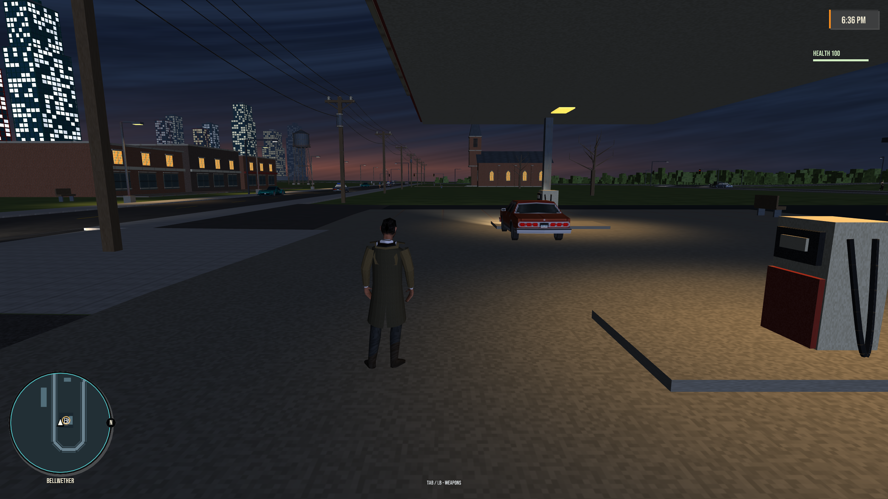
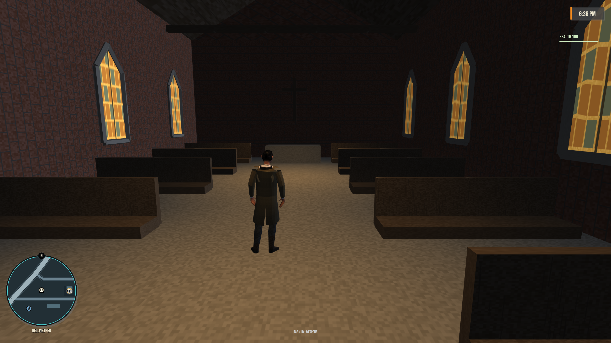
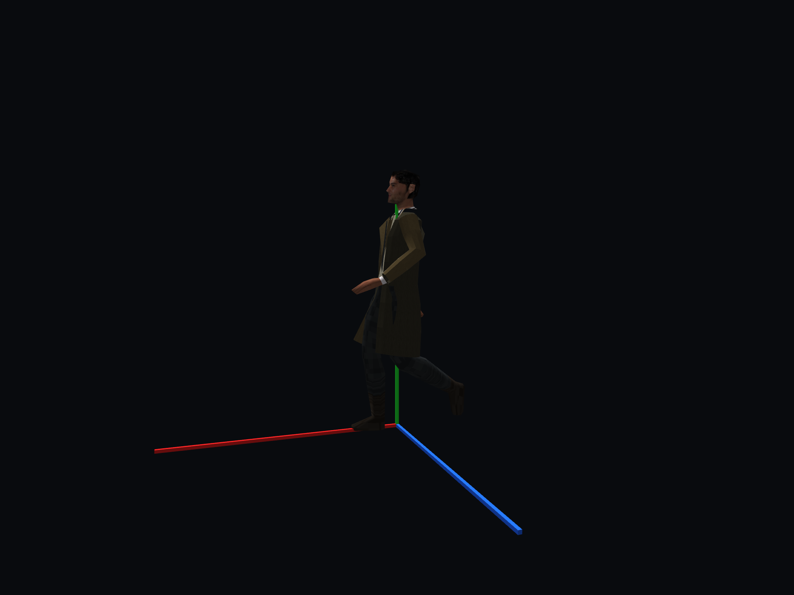

# Bellwether: a playable dusk town

First implementation of the approved gritty 1989 reference, September 26, 2026.

## Visit

From the repository root, with the existing private game assets installed:

```sh
python3 tools/make_bellwether_assets.py
cmake --build build --target apricot -j 4
build/bin/apricot --bellwether --save-file build/bellwether-visit.save
```

`--bellwether` starts directly on foot at Bellwether Service, looking west,
with clear weather and the new dusk sky. Explicit position/heading flags win.
`--dusk` can also apply this sky to a different start location. The town itself
is always part of the world and can be reached from Ferrone Road.

Controls: WASD move, Shift sprint, E enter/exit vehicles, M map, P pause.

## What is in the scene

- A weathered steel water tower with splayed legs, X bracing, tank, roof,
  ladder, pipe and service railing.
- A brick church with a pointed steeple, stone trim, amber lancet windows,
  open entrance, supported steps, pews, aisle, altar and interior roof faces.
- Timber utility poles, insulators, transformers and four sagging wire runs.
- A period service station. The canopy has a red-and-cream fascia on all
  four sides, a brand board front and back, and eight recessed lamps. Each
  pump island carries a dispenser with a readout face and hose to both lanes,
  yellow bollards, a bin and a squeegee bucket. A roadside price board faces
  Main Street traffic. The forecourt has oil drips at the pump bays and lanes,
  an air post, and an apron by the door with party ice, an oil rack and a
  payphone. The lit display windows are solid, so the sill can't be vaulted.
- The store sells nothing yet, but it is stocked: linoleum floor, painted
  walls and ceiling, six fluorescent strips, a lit reach-in cooler bank,
  three gondolas, wall shelving, a register counter with a candy rack, a
  coffee counter and an ice-cream chest. The centre aisle from the door is
  clear.
- Three brick storefront shells, benches, street lamps and bare trees.
- Johnny's regular starting outfit. The olive-brown trench coat model is saved
  for a future clothing-store purchase; see the [clothing plan](clothing.md).
- A blue-hour sky with layered clouds, a muted warm western horizon and
  warm local lamps. It holds the time at 18:36 in this preview.

There are 14 town mesh groups (35,366 triangles), 117 collision boxes,
17 ground surfaces, 19 local lights and six precipitation covers. Terrain
support and scatter exclusion cover the developed parcel. Main Street uses
the normal road graph, sidewalks, traffic and pedestrian systems.

## Layout

World units are metres. Y is height; +Z is south. The town root is
`(480, 11, -700)`.

| Place | World X, Z | Notes |
| --- | --- | --- |
| Bellwether Service | 570, -739 | Forecourt; store centre is 570, -754 |
| Player start | 578, -720 | Looks west across the pumps and landmarks |
| Parked car | 566, -724 | Offset from the store's central approach |
| Bellwether Parish | 438, -743 | Entrance faces south toward Main Street |
| Water tower | 378, -655 | South of Main Street |
| Shop row | 495, -666 | Three closed storefront shells |

Road 245 runs from the existing Ferrone vertex `(300,-700)` east through town,
loops around the east side and reconnects at `(410,-820)`. The authored road
profile and terrace are 11 m high. Store and church floors sit 0.30 m and
0.40 m above that respectively.

## Art and implementation

The five generated sheets are linked in [asset provenance](../assets/bellwether.md).
The [approved image](references/bellwether/approved-town.jpg) remains the target.

The town generator produces visible models, collision/support manifests and
an original material atlas from one source. `src/app/bellwether.cpp` places them.
The trench generator reuses the supplied private character rig and authors a
new skinned outfit prototype. Its reference art and generated assets are kept,
but it is no longer the default player model. The sky uses shader code rather
than a flat panorama.

This is a first playable art pass. The service station has had a second
detail pass (September 26, 2026), but that pass has only been checked in the
generator's output, not yet walked in the game; the results below predate
it. The shop row is exterior-only, and there are no new town missions or shop
interactions. Coat movement uses bone weights, not cloth simulation;
seated and extreme action poses have not had a full outfit review.

## Observed runtime results

These results and captures document the original art pass, before the trench
coat was reserved for a future store purchase.

Built the `apricot` target from this working tree. The isolated 300-frame town
capture completed with a clean GL error queue, about 119 FPS mean on this
machine, and one terrain meshing spike above 4 ms. This is a short local run,
not a performance verdict for every route or machine.

Real game movement through the existing local SDL input bridge:

- Church: walked from `(438,-723)` to `(438,-739.689)` and back outside to
  `(438,-725.684)`. Interior feet stayed at Y=11.40. Health 100, GL errors 0.
- Station: crossed the forecourt from `(570,-715)`, entered the store at
  `(570,-752.995)`, and returned outside to `(570,-738.96)`. Store feet were
  Y=11.30. Health 100, GL errors 0.
- The first church pass exposed a missing porch connection and inward roof
  faces; both were fixed and viewed again. The initial parked car blocked the
  central station approach; it was moved to the adjacent pump bay.
- The actual player model was viewed walking and sprinting in the character
  lab and in the town. The runtime binds the existing animation set to its rig.

Logs, movement traces and intermediate captures live in `build/bellwether/`.
No automated test suite was run for this change.

## Captures

Historical art previews below show the trench coat. Current gameplay starts in
the regular outfit.

### Forecourt and skyline



### Church interior



### Character movement


