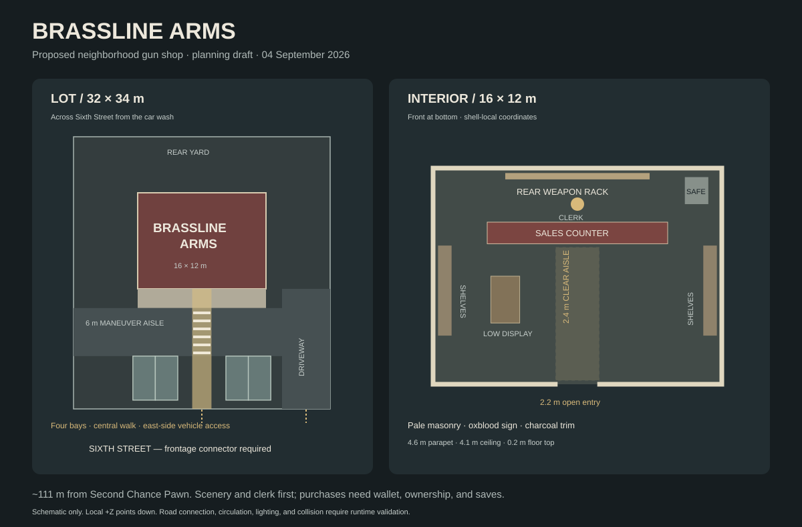

# Brassline Arms — gun store near Second Chance Pawn

Environment built and checked on 2026-09-05 from the three-agent planning draft. The shop is enterable and staffed, with original display weapons, stock shelves, cases, a counter, safe, parking, curb access, sign, and interior lighting. Purchases remain a separate future feature.

## Location and layout

Brassline now occupies the open Sixth Street parcel at grid `(-230,-93)`, one block from The Bent Elbow and 109.29 m from Second Chance Pawn in a straight line. The move preserves the existing storefront, parking, and Sixth Street curb access while putting the shop 207.51 m from the hospital origin and fully outside both its parking garage and southeast shipping/receiving yard.

| Parameter | Built value |
|---|---|
| Authored grid center | `(-230,-93)` |
| World X/Z origin | `(-149.018889,-156.532083)` |
| Basis and ground | `kGridCos`, `kGridSin`, yaw −6°, ground 12 m |
| Lot | 32 × 34 m, local center `(0,0)` |
| Shell | 16 × 12 m, local center `(0,-4)` |
| Front | Local `+Z`, wall at `z=+2`, toward Sixth Street, road ID 36 |
| Driveway | 6 m wide; solver-selected local X center 12.5 m |
| Entrance | 2.4 m authored opening, approximately 2.2 m between frame faces |
| Height | 4.1 m ceiling underside, 4.6 m parapet; raised sign and HVAC above |

The lot stays fixed. The production access baker connects the gap to Sixth's sidewalk and makes the curb opening from the same triangles used for road collision. Allowed spine `{36}` prevents a connection to Seventh behind the shop. The access solver moves the requested driveway center from 13 to 12.5 m to reserve its edge margin.

The implemented test checks the full lot every 0.5 m against current authored roads, samples real terrain support, checks neighboring access parcels plus the newer bar/towers, and directly rejects the hospital shipping/receiving envelope. The whole-city authored-lot test separately includes that service-yard envelope alongside the hospital, every current downtown parcel, and the outlying authored sites.

Coordinates and the shared basis govern authoring; some older source comments reverse compass directions.



The schematic uses local coordinates with the street at the bottom. Final sign height, fixture lighting, and driveway center follow the implementation described here.

## Art and interior

Pale masonry, brick side/rear walls, charcoal steel, a worn oxblood sign, scuffed concrete floor, and a timber display wall. The storefront uses open framed spans with thin security bars. The central customer route stays clear, with display furniture on the sides and broad passages around each counter end.

The generated sign is preserved intact at `assets/textures/world/neighborhood/brassline-arms.png`. Its 2121 × 741 aspect ratio maps to a 6.4 × 2.236 m raised fascia. The sign sits forward of the roof trim, which otherwise crossed its lettering. [Exact imagegen prompt and provenance](../assets/brassline-arms-generated-texture.md).

Interior coordinates below are shell-local, with the front at `z=+6`. Subtract 4 from Z to get site-local coordinates. Floor top is 0.20 m above site ground.

| Element | Shell-local center `(x,z)` | Width × depth |
|---|---|---|
| Counter | `(0,-2.4)` | 10 × 1.2 m |
| Clerk | `(0,-4)` | Faces the entrance |
| Rear weapon rack | `(0,-5.55)` approximately | 8 m wide |
| Side shelves | `(±7.35,0.8)` | 0.75 × 5 m each |
| Low display island | `(-4,1.3)` | 1.6 × 2.6 m |
| Safe | `(6.6,-4.75)` | 1.3 × 1.5 m |

Four original long-gun silhouettes hang on the rear wall; two compact firearm props rest on counter mats. Shelves hold boxed stock, and hard cases sit on the island and window plinths. These are decorative objects, with furniture providing collision.

Four ceiling downlights, three rack lights, two angled counter lights, and two exterior lamps use actual runtime light sources. The rack/counter lights were added after night inspection showed that downlights alone left vertical stock and the clerk too dark. Nearby materials are reused; no new weapon or character pack is required.

Outside, site-local `z=2…4.4` is the storefront walk, `z=4.4…10.4` is the 6 m maneuver aisle, and `z=10.4…15.9` contains four 2.8 × 5.5 m bays at `x={-7.2,-4.4,4.4,7.2}`. The 2.4 m central walk is interrupted by a flush painted crossing through the vehicle aisle.

## Integration

- `src/city/gun_store.h`: authored site, plan, fixtures, and support-surface predicate.
- `src/city/building_access.h`: fixed parcel inventory and Sixth-only access.
- `src/app/world.cpp`: materials, sign, scene registration, oriented wall/fixture collision, and floor/walk support.
- `src/city/authored_staff.h`: appended stable clerk identity; Devon retains index 1.
- `src/app/app.cpp`: fixture-derived lights, with optional local aiming for the new wall washes.
- `src/app/game_ui.cpp`: both pawn and gun-store footprints and Places entries. Icon choice is explicit rather than tied to array position; navigation remains bearing-only.
- `src/main.cpp`, `src/app/app.h`, `src/app/app.cpp`: `--start-player-at X Z` places the on-foot player independently of the parked car for interior QA. Non-finite inputs and combination with `--start-driving` are rejected.

The reusable local skill is `/Users/andrewbaker/.codex/skills/apricot-city-planner/SKILL.md`. It covers parcel survey, authored geometry, access/curb integration, shared collision, staff, map, lights, and behavioral plus visual validation. The bundled skill validator passes.

## Validation

All six relocation-focused suites pass: `gun_store_tests`, `building_access_tests`, `authored_city_layout_tests`, `pawn_shop_tests`, `minimap_tests`, and `ui_flow_tests`.

The new suite uses the real character controller and baked world collision to walk from the sidewalk through the entrance, browse, reach the counter, pass around the staff side, and leave. Counter and sealed-door negative controls block the same movement. The real vehicle simulation crosses the final driveway in both directions at 5 m/s with zero impacts; all four bays have a tested pedestrian path to the entrance. Full vehicle parking turns and live player input were not automated by this suite.

The shared access suite validates all 24 authored entrances, their slopes, lamp clearance, and exact rendered/collision triangle correspondence. New-site bounds and staff checks also pass. The new QA CLI's invalid-input and incompatible-mode checks return exit code 2 as intended.

Rebuilt and launched the actual game after the move. The street-level daylight capture shows the complete Brassline storefront, lot, parking, crosswalk, and neighboring city fabric with no hospital service geometry crossing the parcel. The run completed with a clean GL queue. The full-map lab also rendered cleanly and shows the new Brassline footprint away from the hospital campus.

Current relocation evidence:

- `build/qa/brassline-move/street-day.png`
- `build/qa/brassline-move/map.png`

Original captures under the ignored build directory predate the parcel move and are retained only as interior/art references:

- `build/brassline-exterior-day.png`
- `build/brassline-interior-day.png`
- `build/brassline-interior-night.png`
- `build/brassline-map.png`

Reproduce from the repository root:

```sh
cmake --build build --target apricot gun_store_tests building_access_tests authored_city_layout_tests pawn_shop_tests apricot_map_lab -j8
ctest --test-dir build --output-on-failure -R '^(gun_store_tests|building_access_tests|authored_city_layout_tests|pawn_shop_tests|minimap_tests|ui_flow_tests)$'
./build/bin/apricot --start-at -148.5091 -211.7798 --start-player-at -151.6321 -131.6690 --start-heading -6 --frames 180 --clear --daylight --save-file /tmp/brassline-move-qa-save.json --screenshot build/qa/brassline-move/street-day.bmp
./build/bin/apricot_map_lab --zoom 16 --x -149 --z -157 --layer 2 --screenshot build/qa/brassline-move/map.png
```

Screenshots are SDL BMPs. The preview PNGs are format conversions without image edits. The full project suite was not rerun for this scoped environment change.

## Future purchase feature

The current wheel offers Unarmed and a presentation-only Pistol. There is no wallet, owned inventory, ammo model, or purchase system; current strict v1 saves omit weapons and cash.

A purchase follow-up can add a one-item Pistol catalog at the customer side of the counter. First settle starting cash or an earning source, price, and old-save ownership. Debit cash and grant ownership atomically, gate every selection input including the direct keyboard shortcut, and persist wallet/owned/equipped state with backward-compatible migration. Use the existing modal input pattern and test exact funds, insufficient funds, repeated purchase, cancel, through-wall interaction, and save/load/equip behavior. Ammo, combat, robbery, resale, attachments, and extra weapon classes remain separate work.
