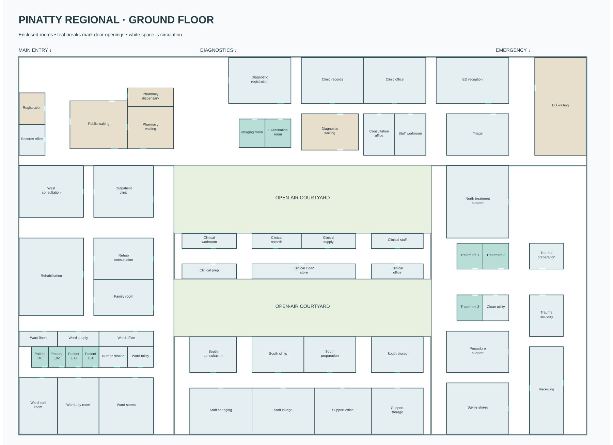

# Pinatty Regional Hospital ground-floor rooms

The ground floor has 58 enclosed rooms joined by public, ward, clinical and
service corridors. The room plan lives in `src/city/hospital_rooms.h`.

## Layout

- **Public entrance:** a clear central lobby leads past an enclosed registration
  office and separate public waiting room. Registration serves the lobby through
  a broad counter window; staff enter from the side hall.
- **Pharmacy:** a separate dispensary serves its own waiting room through a
  south-facing service window. Shelves, preparation bench and pickup counter
  face the same way and fit inside the room.
- **Diagnostics:** registration, waiting, imaging and examination are separate
  rooms. The two clinical rooms are 10 by 11 metres, with individual doors onto
  the connecting hall. Each has an exam couch, privacy screen and wall-backed
  handwash station; imaging also contains the ultrasound cart.
- **Emergency:** three 10 by 10 metre treatment rooms flank the trauma corridor.
  Beds, medical rails, monitors and privacy curtains sit inside those rooms.
  Triage, preparation, recovery, utility, receiving and stores have their own
  enclosures and doors.
- **Ward:** four 6.5 by 8 metre single-bed rooms open onto a continuous four-metre
  corridor. Each has full-height side and head walls, a framed doorway, an open
  door leaf, bedside storage, monitor, visitor chair and IV stand. The nurses
  station, utility, linen, day room and staff rooms sit alongside the ward.
- **Support areas:** consultation rooms, offices, rehabilitation, changing,
  stores and staff rooms occupy the west wing, clinical spine and south bar.
  Their furnishings are anchored to room bounds rather than world-space spots.

The two courtyards stay open to the sky. The main entrance axis at `x=0`,
diagnostic approach at `x=60`, court portals at `x=72/118`, trauma route at
`z=74..84`, and garage approach at `x=45..51` remain connected to the halls.

## Construction

Walls run from the finished floor at local height 0.315 m to the ceiling at
3.43 m. Shared collinear runs are merged before baking so adjoining rooms do
not add overlapping walls or fill each other's doors. Each partition uses the
building creator's wall-and-opening system: rendered wall pieces and collision
come from the same geometry.

Door openings are 1.8 to 2.4 m wide and 2.4 m high before trim. Patient doors
are permanently open leaves parked inside the jamb; these doors are not animated.
Reception and pharmacy windows use raised-sill openings. Skirting and protective
rails follow the solid wall pieces and stop at doorways.

The former freestanding ward, emergency, registration and imaging backdrops
have been removed. Medical fittings and signs now attach to actual room walls.

## Finishes and integration

The existing 17 hospital textures supply terrazzo, wall paint, acoustic ceiling,
upholstery, laminate, curtain fabric, steel, fitted department signs and screens.
Ceiling fixtures follow the furnished rooms and connecting corridors. Existing
hospital runtime lighting handles their day and night illumination.

`bake_hospital_overhaul_interiors()` appends the room plan, room-bound support
fixtures and detailed clinical furnishings to the integrated hospital stream.
This interior plan is for the ground floor; the upper floors retain the existing
shell layout.
