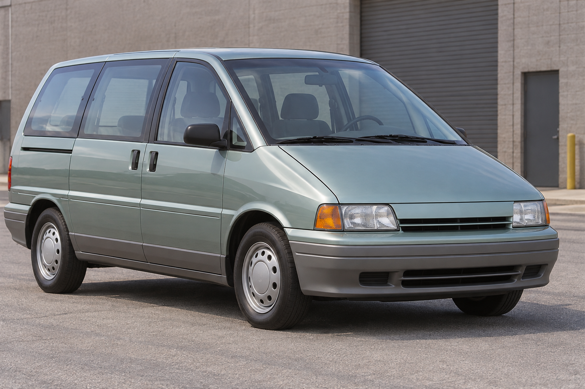
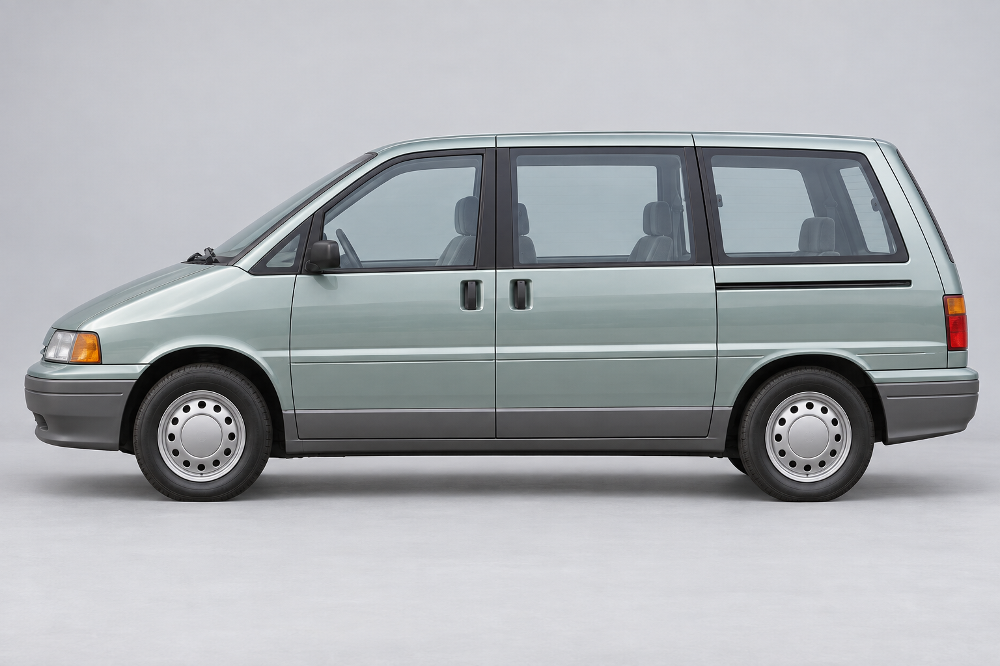
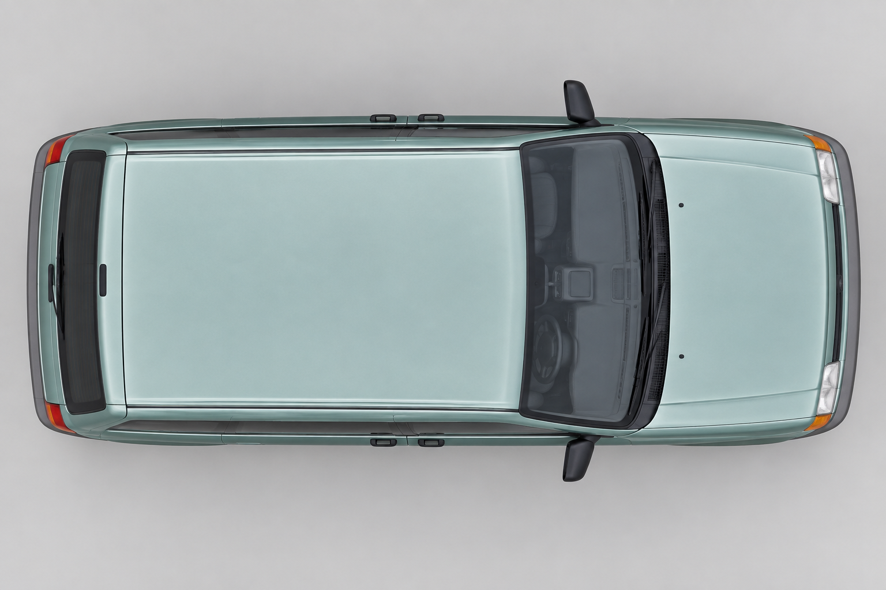

# 1991 GLM Meridian references

[Manufacturer and model page](../../../world/vehicles/GLM/Meridian.md)

Selected from [candidate 1](concept-selected.png): a seven-seat, cab-forward
family minivan. These seven views are the directional reference set for the
playable model. Keep the pale seafoam body, charcoal lower bumpers and rockers,
dark window pillars, rectangular headlights with amber outer indicators,
upright rear hatch, and silver steel wheel covers with round holes.

| Feature | Controlling views |
|---|---|
| Overall identity and color boundaries | [front three-quarter](front-three-quarter.png), [rear three-quarter](rear-three-quarter.png) |
| Wheelbase, roofline, windows, doors and sliding track | [left](left.png), [right](right.png) |
| Headlights, grille and front bumper | [front](front.png) |
| Hatch, rear glass, taillights and rear bumper | [rear](rear.png) |
| Solid painted roof, hood and windshield placement | [top](top.png) |

Resolve image differences as **one hinged front door and one sliding rear door
per side**, plus a fixed rear-quarter window. The two handles near the B-pillar
belong to those two doors; do not turn them into extra doors. Put a single
sliding track under the rear side windows on each side. Use the side views for
axle positions and window divisions, and the top view for a solid roof without
a sunroof. The three-quarter views guide surface shape and material placement.
The shape contract uses a 4.86 m body length, 1.82 m base body width and
2.78 m wheelbase; these are authored estimates rather than factory measurements.

The runtime model uses transparent glass and mapped cabin, seat, dashboard,
door-interior and headliner surfaces. These images remain concept references,
not engineering drawings. Rebuild the playable model with
`python3 tools/make_1991_candidates_assets.py glm_meridian`.

[Complete three-vehicle reference index](../1991-selected-vehicles.md).

## Curved-edge revision

The roof has a broad shallow crown, rolled eaves and shared rounded corners across the roof and window frames, with transparent glass tucked behind the surrounds. The front and rear transitions now extend 300 mm inward and drop 135 mm from the center crown to the header. These rolls follow the three-quarter references; fitted window tops and rain channels meet the revised roof. The hood has softer shoulders, the side panels have a gentler crown, and the bumpers have rounded upper and lower returns. The wheelbase, wheel size, driving position, opening front door and transparent windows keep their existing fit.

[See the updated playable model](../../reviews/1991-vehicle-refinement/README.md#glm-meridian).

## Reference photo gallery

These are the generated design references used to shape the playable vehicle.

### Selected concept

### Front three-quarter

### Rear three-quarter

### Front

### Rear

### Left side

### Right side

### Top

