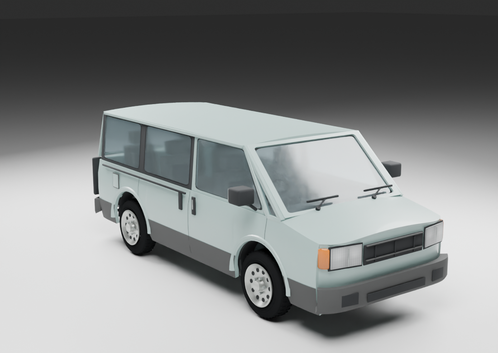
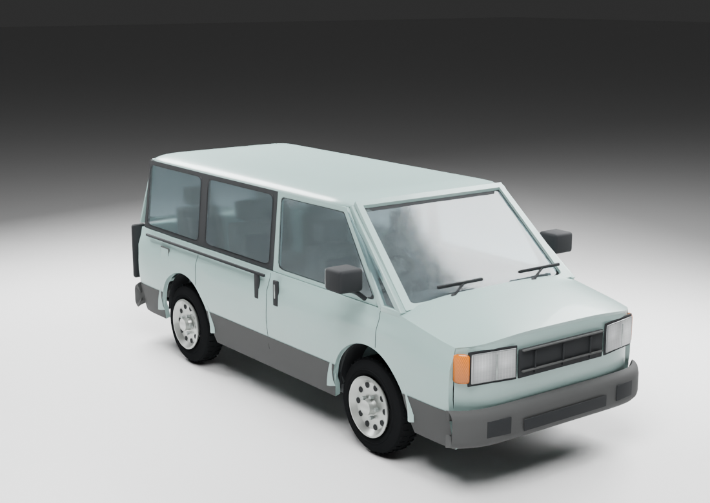
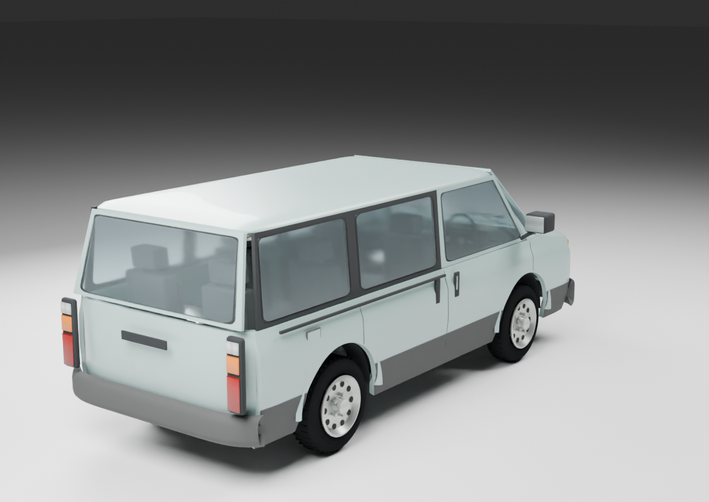
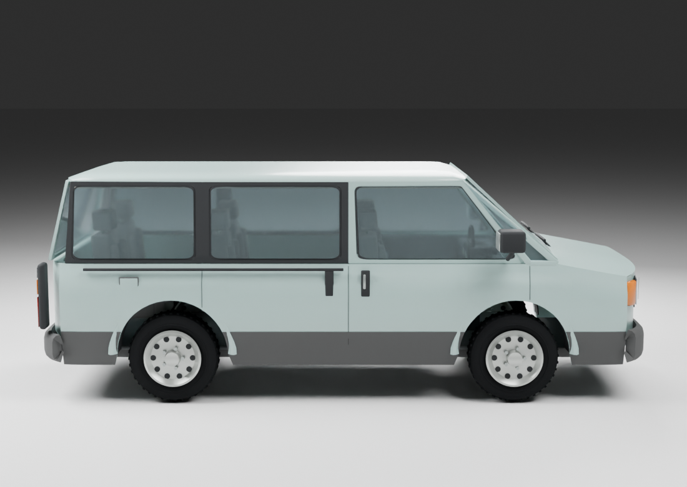

# 1991 vehicle refinement review

This pass moves the three playable models toward the selected reference photos: tighter stamped panels and trim, clearer shut lines, realistic cabin proportions, less padded upholstery, dished wheels, ribbed lamp lenses and fitted mechanical parts. The Meridian has a lower roof and a longer hood. The Hookline has a higher cab beltline, service-panel seams and a supported recovery boom with winch and sheave hardware.

These studio images are renders of the saved Blender models. The game captures show the cooked meshes, transparent glass, driver and atlas in Apricot's renderer. They are separate from the original [24 concept and directional reference photos](../../references/1991-selected-vehicles.md).

## GLM Meridian

### Curved-edge update

The latest Meridian adds a shallow curved roof with rolled eaves, rounded roof corners, softer hood shoulders, gently crowned sides and rounded bumper returns. Wheel size and axle positions are unchanged. Its opaque roof and frames share the corner shaping; the transparent glass remains tucked behind the surrounds.

| Previous model | Current model |
|---|---|
|  |  |

[All eight Meridian reference photos](../../references/glm_meridian/README.md#reference-photo-gallery).

[Rear](glm_meridian-rear.png) · [Side](glm_meridian-side.png) · [Door partly open](glm_meridian-door-partial.png) · [Door open](glm_meridian-door-open.png) · [Door interior](glm_meridian-door-inside.png) · [Game capture](glm_meridian-game.png)

### Front and rear roof roll

The follow-up corrects the sharp roof lip above the windshield and rear hatch. Both ends now roll down over 300 mm, with a 135 mm center-height change. Dense cross sections preserve that curve in the cooked model; the adjoining glass, frames, side rails and headliner follow the revised boundary.

These pairs use the same studio cameras and lighting:

| View | Before roof roll | Current roof roll |
|---|---|---|
| Front |  |  |
| Rear |  |  |
| Side |  |  |

The cooked vehicle in Apricot's driver lab, including its transparent glass and cabin:

## Rodeo Switchback

[Rear](rodeo_switchback-rear.png) · [Side](rodeo_switchback-side.png) · [Door partly open](rodeo_switchback-door-partial.png) · [Door open](rodeo_switchback-door-open.png) · [Door interior](rodeo_switchback-door-inside.png) · [Game capture](rodeo_switchback-game.png)

## Harrow Hookline

[Rear](harrow_hookline-rear.png) · [Side](harrow_hookline-side.png) · [Door partly open](harrow_hookline-door-partial.png) · [Door open](harrow_hookline-door-open.png) · [Door interior](harrow_hookline-door-inside.png) · [Game capture](harrow_hookline-game.png)

## Verification and limits

The Meridian roof-roll revision has 56,996 body triangles, below the existing 60,000 ceiling. Its asset checks include wheel radii; the rebuilt game passed the 650-frame door/driver transition check and a fresh 180-frame daylight capture with a clean graphics error queue.

The checks below cover the relevant geometry and entry/exit behavior. The 650-frame run had streaming spikes while other local workloads were active; it is not a frame-rate benchmark.

- Asset validation checks finite geometry, unit normals, nondegenerate triangles, mapped UVs, wheel openings, dimensions, atlas format and required parts.
- `new_vehicle_models_tests` passed again for this roof revision. The earlier fleet refinement also passed `vehicle_driver_pose_tests` and `license_plate_tests`.
- All three passed the actual game's driver-transition check: door sweep, entry, exit, blocked paths, cancellation, re-entry and exit-camera clearance.
- All three completed the final 180-frame daylight game captures with a clean graphics error queue.
- The existing `vehicle_snow_mesh_tests` failure remains on the unrelated Halcyon Sovereign windshield. The full suite is not claimed green.
- Tow equipment is modeled visually; towing gameplay and factory-paint respray profiles remain outside this refinement.

Rebuild with `python3 tools/make_1991_candidates_assets.py`. Render a saved model with `/Applications/Blender.app/Contents/MacOS/Blender -b --python-exit-code 1 --python tools/render_1991_candidates.py -- glm_meridian` (or the other model key). Editable sources are generated in the private `assets/models/vehicles/<model>/source.blend` folders. `manifest.json` records the reviewed asset hashes.
