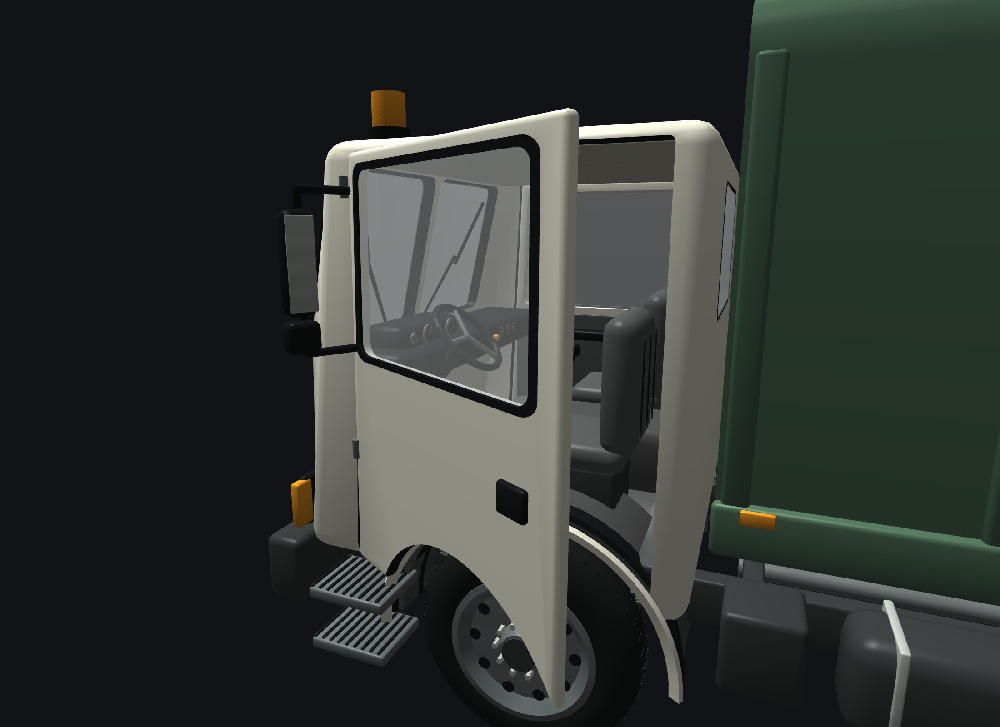

# Harrow Rearloader — asset review

**Class 3 — individually reviewed 2026-09-26 against Hookline.** Reference fidelity, connected rounded panels, finished cabin/inner faces, detailed equipment and complete image documentation meet the working Class 3 definition. This records an agent review, not a new user-designated benchmark. [Generated references](../../references/harrow_rearloader/README.md) · [Model page](../../../world/vehicles/Harrow/Rearloader.md).

## Reference comparison

The working concept and seven directional references were saved and reviewed before this model was constructed. The left reference controls wheelbase, overhangs and cab height; the front controls the split glazing and fascia; the rear controls the hopper and stacked lighting. Small disagreements between generated views are documented in the reference contract.

| Generated target | Authored Blender model |
|---|---|
|  |  |
|  |  |
|  |  |
|  |  |
|  |  |

The studio side cameras are true untilted orthographic views. The generated side images place the nose in the opposite screen direction to the corresponding authored camera; compare the same stations and dimensions, not pixel overlap.


## Detail and inner surfaces

Compared with the user-designated Class 3 [Hookline](../../../world/vehicles/Harrow/Hookline.md), this asset has the same family of separate glazing, mapped cab, thick driver door, steel wheel detail and visible work equipment. Its own design uses a taller cream cab and a rear-loading refuse body.

- Hollow cab shell and driver door are each connected closed solids. Roof corners and windshield rake belong to the shared cab geometry.
- Cab windows are real openings with separate glazing; the moving glass and mirror belong to the driver door.
- Seat cushions/backs, engine cover, dashboard, instruments, steering, gear lever, pedals, floor, headliner, wheelhouse tops, inner door cards and door latches have intentional atlas regions.
- The rear hopper is actually open, with mapped interior cheek plates, curved trough, packer face, blade beam and loading sill. Hydraulic barrels, chrome rods, pivot pins, linkages and connected hoses have depth.
- Rear workers' platforms, tread, grab rails, safety stripes, stacked lamps and a supporting rear beam are modeled.
- Single front tires and dual rear assemblies are separate exports, with dished rims, vents, lugs and matte rubber.
- Plate backings are blank; named mount planes are recorded. Registration text belongs to runtime.

### Door partly open


### Door open


### Door inside


### Cabin


## Checks and corrections

The first asset review found a cavity-normal error that left an opaque wall behind the door, unsupported upper rear lamps, a daylight gap beside the hopper trough, and over-pronounced tire shoulders. Those were corrected before the current gallery. The inner cabin wall regression now has actual ray checks in the generator/source audit. The floor and cab arch cuts also clear the near-side wheel pockets while preserving the central floor.

The final pass replaced blank instrument inserts with analog faces, graduations, red needles, telltales, rocker switches and a parking-brake knob. Access steps moved forward to Z +3.17 m to clear the tire envelope at full steering lock. Runtime entry detection now targets the front steps instead of the generic front-door estimate; that fixed a failed entry check on the first game run. The fitted driver's wrists and ankles reach their controls without pose error.

[Structural report](validation.json) and [connected-shell/aperture audit](source-audit.json):

| Check | Result |
|---|---|
| Opaque body | 50,792 triangles; declared cap 65,000 |
| Body without driver door | 48,548 triangles |
| Driver door assembly | 2,244 triangles |
| Wheel meshes | 4,936 front single; 9,872 rear dual |
| Geometry | Finite, nondegenerate triangles; valid indices and unit normals |
| UV/texture | All UVs inside atlas; 256×256 RGBA |
| Wheel openings | Four outer axle-center projections clear |
| Cab and door shell | One connected component each; no boundary or nonmanifold edges |
| Glazing apertures | Both windshield openings and door frame ray checks pass |
| Private source | Editable named parts and anchors in `source.blend`; cooked files remain ignored |

## Runtime review

- Catalog selection, fitted driver/door/glass, four wheel nodes with rear dual tires, truck camera, lamps, commercial plates, paint, sound profile and snow/wiper mappings are integrated.
- Production-renderer captures show transparent glazing, the finished cab and both faces of the door. Partial/full door opening, seated driver and an exit-sequence midpoint were inspected.
- Opposite full steering locks were inspected at physical suspension endpoints. The step tread stays ahead of the front tire; suspension uses the same rest/travel mapping as the game.
- The actual game completed a **650-frame transition regression**: door sweep, staged entry, repeated input, blocked exit, blocked entry/exit cancellation, safe exit, re-entry and ignition once per entry all passed. The exit-camera check passed too.
- A separate **300-frame game run** rendered the truck on the road and ended with a clean GL error queue. Its screenshot is below. These checks cover the truck; they are not a claim that the entire game's runtime has been tested.
- Focused suites passed: vehicle models, driver pose, interaction, UI flow, plates, tuning and snow meshes. The interaction regression covers the cab-over approach at three headings.
- Production physics measured **69.2 mph** and **21.4 s to 60 mph**, Classic GTA, flat dry Rock, automatic, unladen 10,500 kg. [Raw result](performance.csv) · [Measurement/source snapshot](performance-snapshot.json).

[Runtime command/result record](runtime-checks.json) · [Source and image hashes](manifest.json).


| Production renderer front | Production renderer rear |
|---|---|
|  |  |





| Full lock, compressed | Opposite lock, extended |
|---|---|
|  |  |

## Scope

Cabin construction and concealed chassis details are inferred. Packer and hydraulics are static visual geometry. No refuse collection, compacting, worker gameplay or ambient refuse-service traffic is implemented.

## Reproduce

```sh
python3 tools/make_harrow_rearloader_assets.py
/Applications/Blender.app/Contents/MacOS/Blender -b --python-exit-code 1 \
  --python tools/render_harrow_rearloader.py
```

The cooker generates the atlas, Blender source, nine cooked parts, anchors and reports, then runs the source audit and cooked structural validator. Model images are rendered from the saved source; generated references are never substituted for model evidence.
