# Meridian roof and window reference comparison

The earlier roof-only rollover was rejected: it retained nearly vertical, square rear-quarter glazing, a roof that was too wide and long, and a thick cap above the windshield. This revision rebuilds the roof, pillars, window surrounds and panes together.

## What controls the shape

- **Selected concept and front/rear three-quarter references:** overall identity, continuous roof/pillar curves and the black side-window band.
- **Left side:** sloping rear-quarter opening, broad front-door upper corner, shorter roof footprint and long windshield rake.
- **Front and rear:** inward glass lean, upper screen taper, shallow arched headers and rounded roof shoulders.
- **Top:** roof footprint and restrained glass bow.

The generated references vary slightly. Dimensions below are authoring choices fitted to their shared shapes, not factory specifications. The existing 4.86 m body length, 2.78 m wheelbase and wheel rig remain the scale anchors.

| Cabin feature | Rejected model | Revised model |
|---|---|---|
| Roof front/rear stations | +1.02 / −2.25 m | +0.64 / −2.02 m |
| Roof width near the center | About 1.62 m | About 1.44 m |
| Upper windows | Nearly upright sides, flat screens | Inclined sides, gently bowed front/rear screens |
| Rear quarter window | Nearly rectangular | Forward-sloping rear edge with a larger rounded upper corner |
| Front door window | Small corner rounding | Broad curved transition into the raked front edge |
| Window band | Narrow seals and exposed painted dividers | Black B/C pillars and broader black surrounds |

The opening driver door and its hinge were shortened together to match the new front-window/quarter-window split. Exposed frame backs, headliner and inner door surfaces retain mapped materials.

## Reference beside the actual model

These are original generated references beside renders of the editable model. Flat model views use untilted orthographic cameras; the references have slight perspective and are not engineering drawings.

| Angle | Reference | Revised model |
|---|---|---|
| Side | 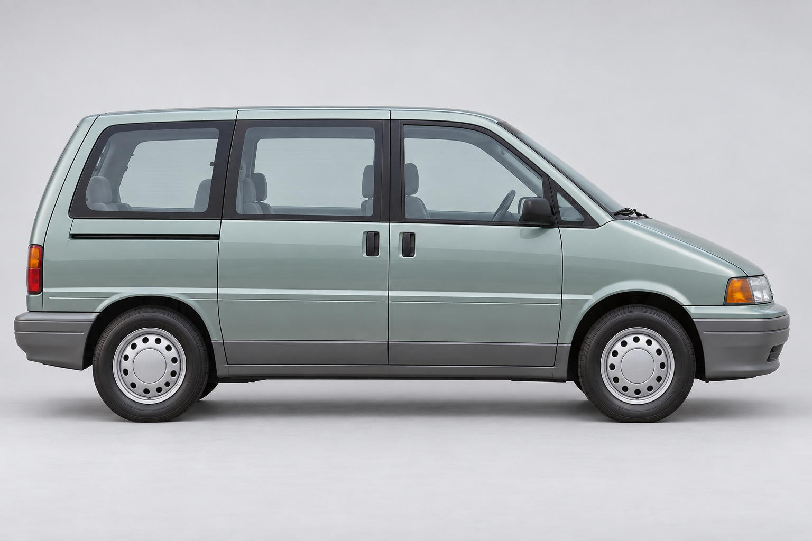 | 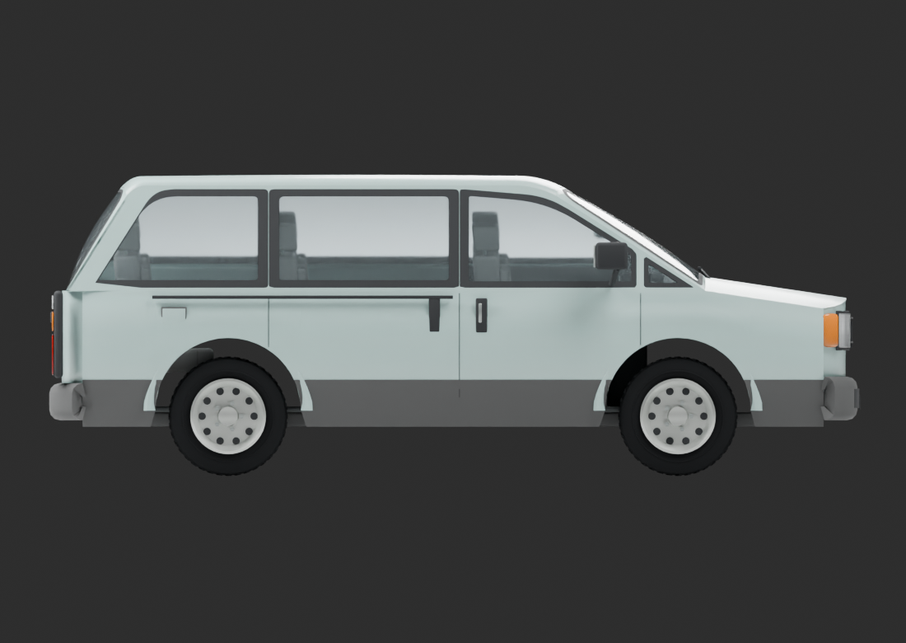 |
| Front | 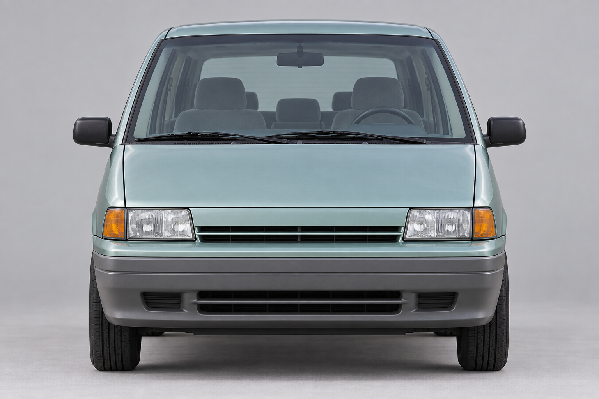 | 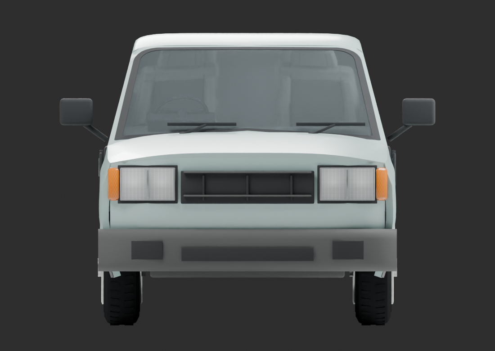 |
| Rear | 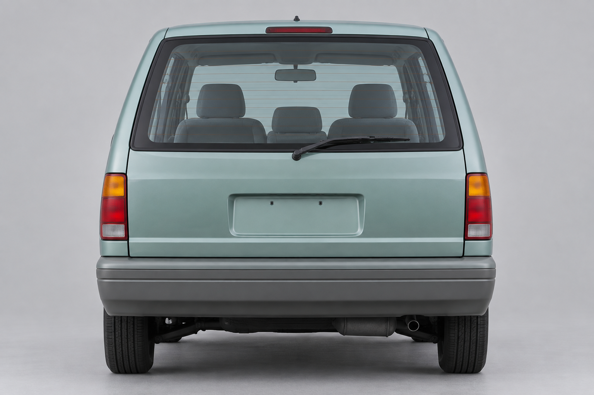 | 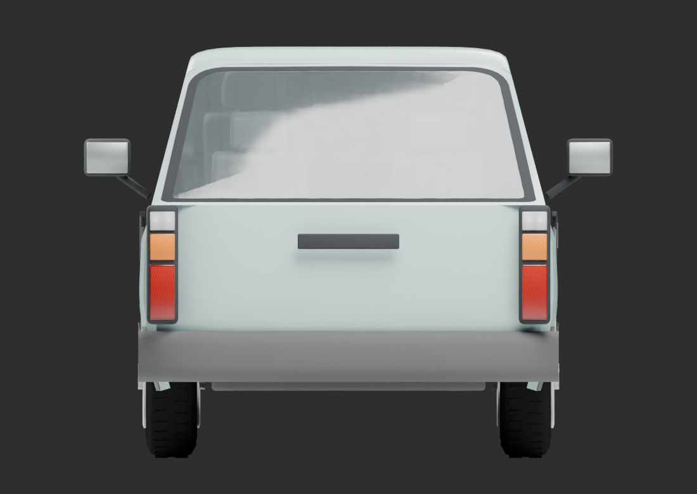 |
| Front three-quarter | 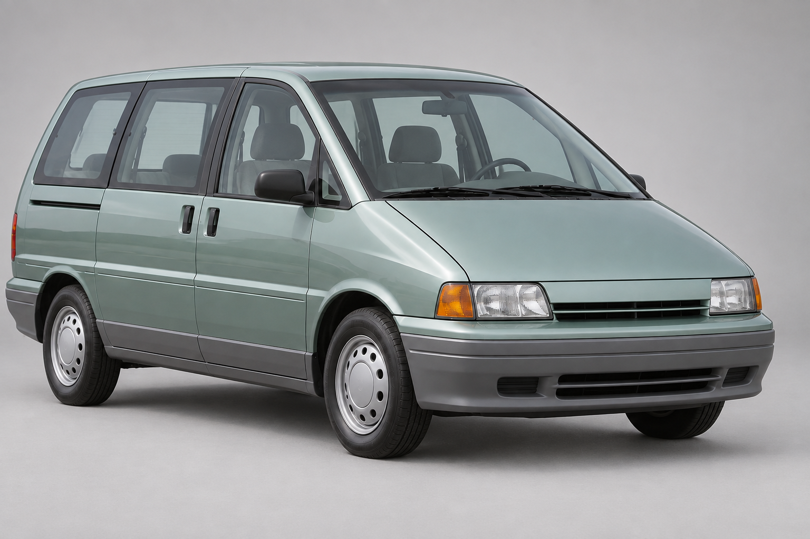 | 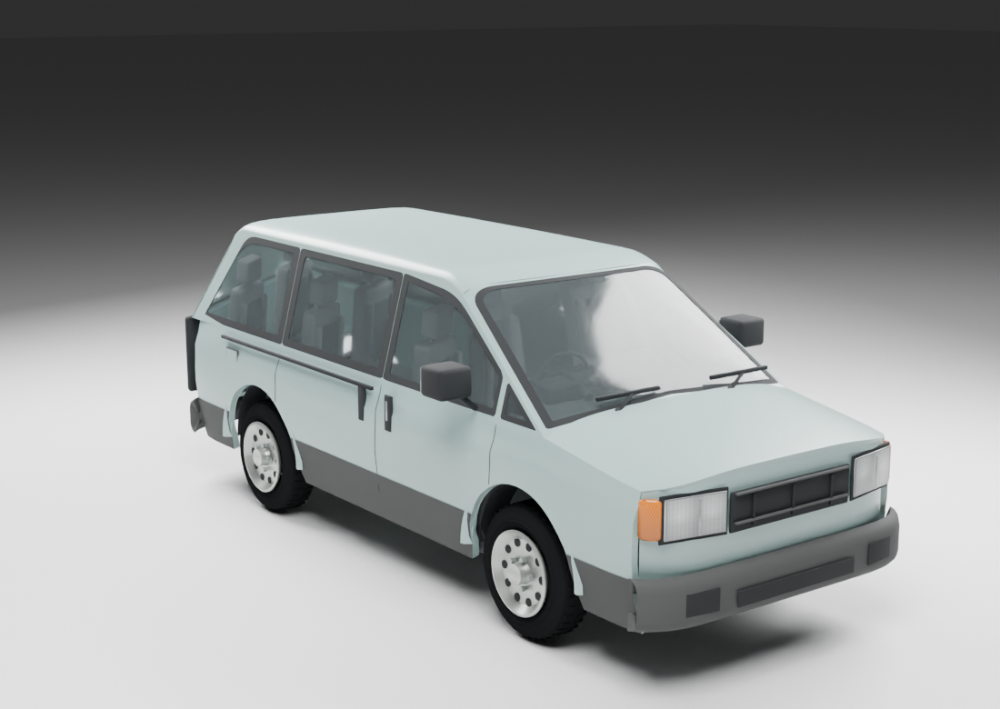 |
| Rear three-quarter | 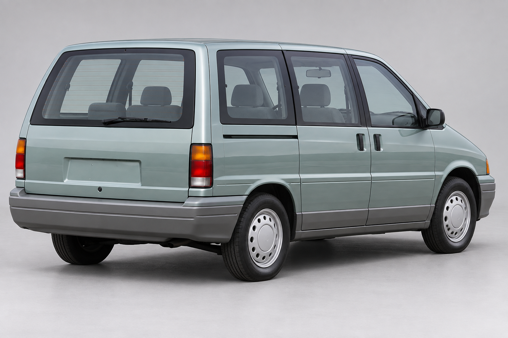 | 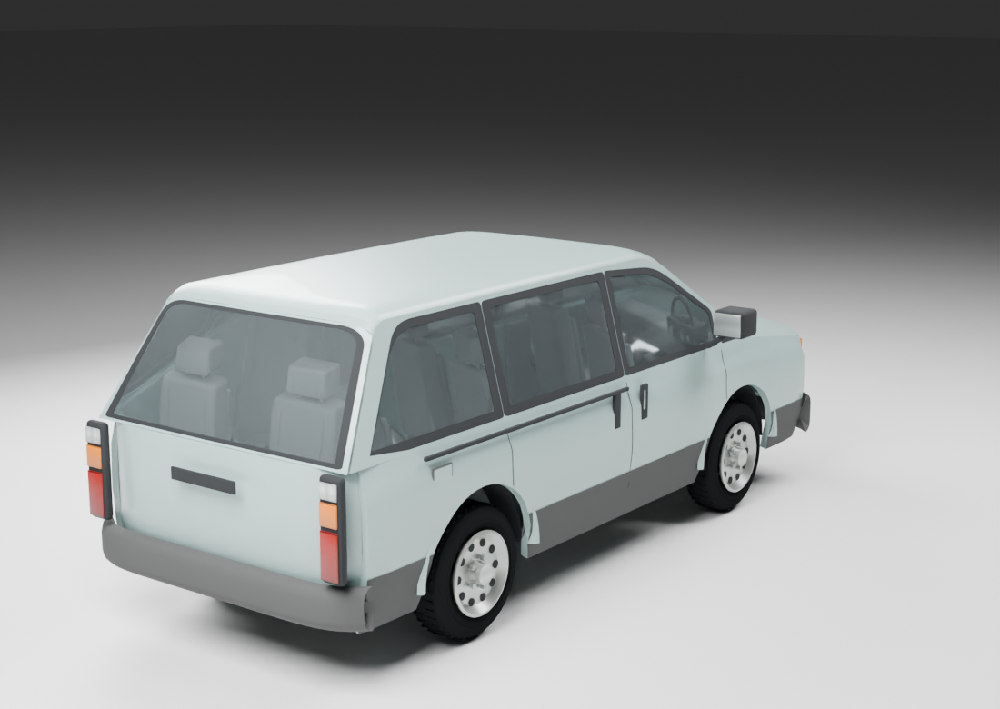 |

[Vehicle page](../../../world/vehicles/GLM/Meridian.md) · [All original references](../../references/glm_meridian/README.md)

## Verification

- 56,280 body triangles, below the existing 60,000 ceiling; finite geometry, unit normals, UVs, wheel openings and required part checks passed.
- `new_vehicle_models_tests` passed with the new cabin and door geometry.
- Rebuilt game passed the 650-frame Meridian door/entry/exit regression, including blocked paths and re-entry, with a clean graphics error queue.
- Inspected front/rear cooked-model views in the game renderer, three flat studio views, both three-quarter views, and open-door interior/exterior views.
- Fresh 180-frame daylight game capture completed with a clean graphics error queue.

These checks cover construction and runtime behavior. Visual approval remains with the user; this comparison does not assign a quality class.

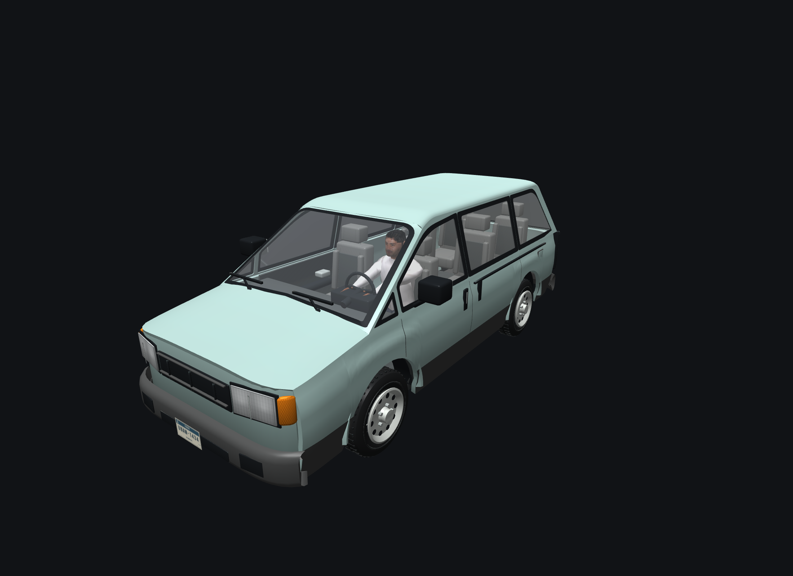

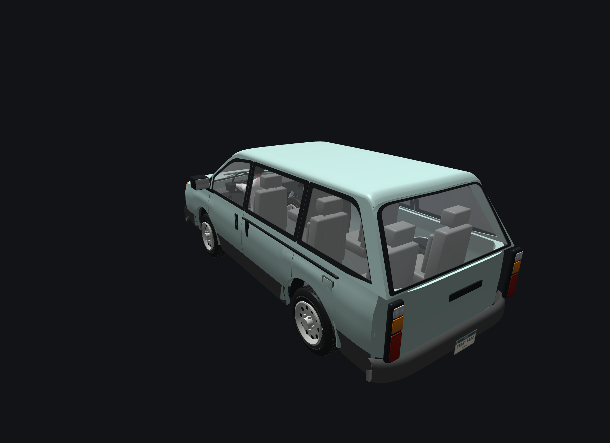
