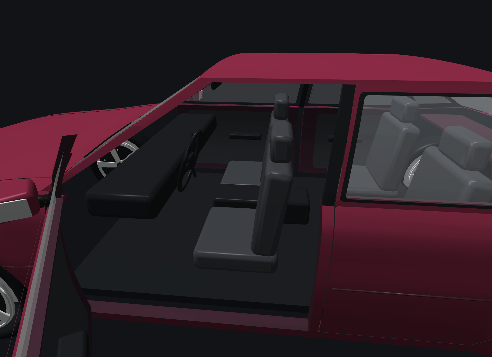
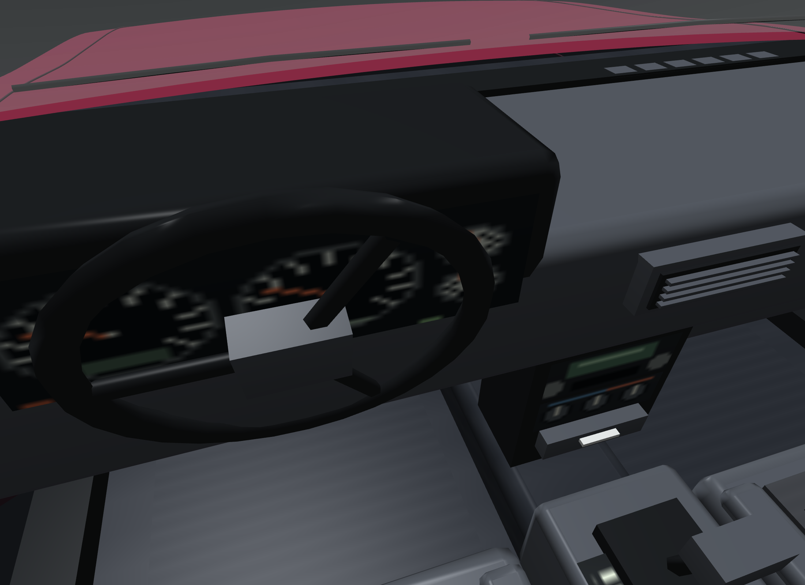
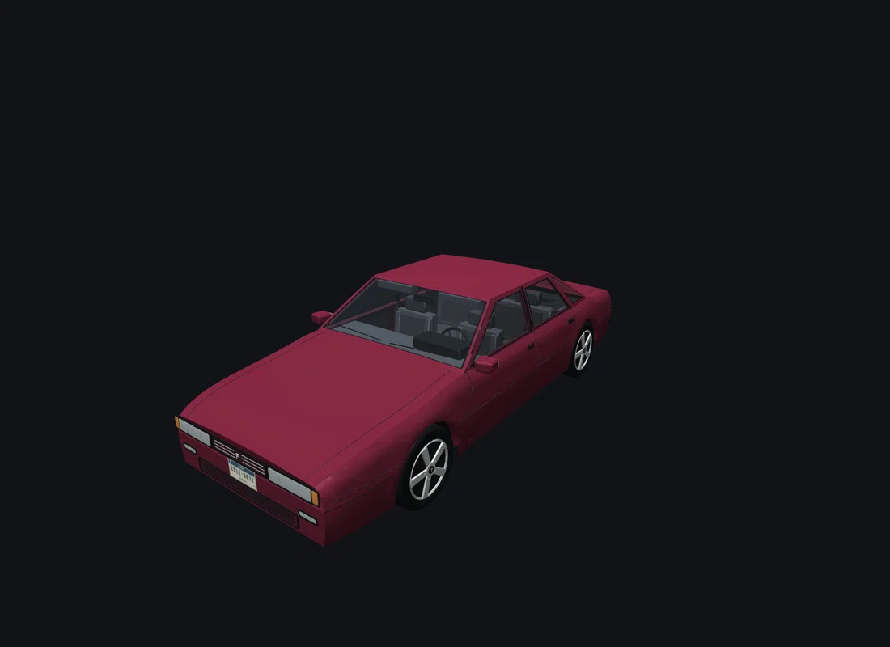
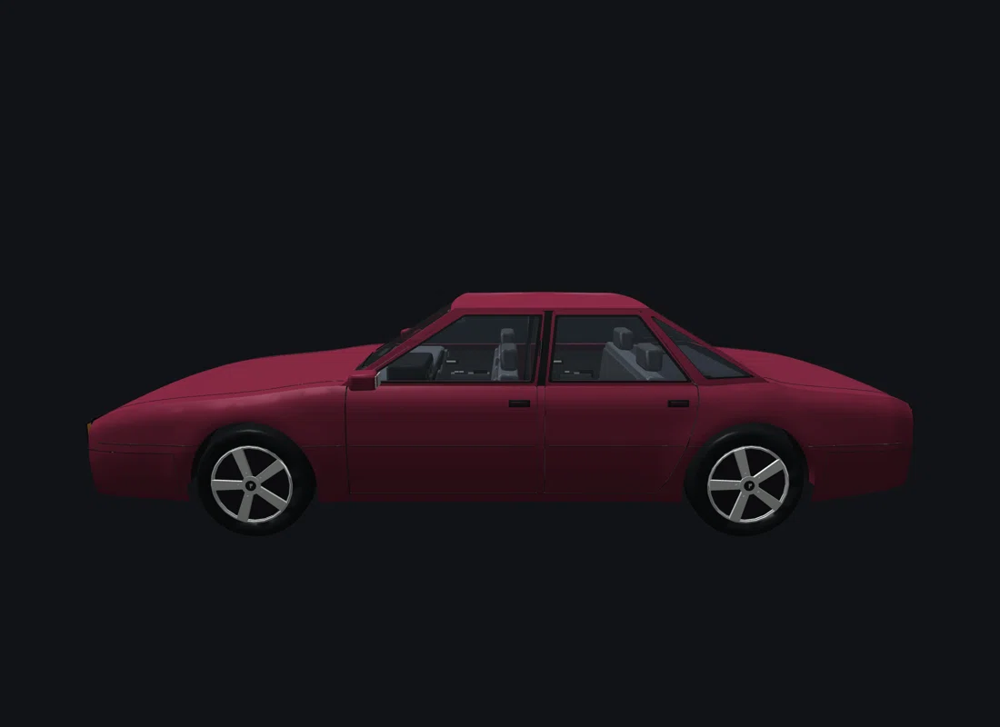

# Pizaz Constant — cabin and surface repair

2026-09-26. Based on source commit `28dbf96` (0.8.0).

The player reported flickering surfaces and a view through the dashboard to the
road. Baseline inspection found no front firewall, a floor narrower than the
cabin, and unsealed rear corners. Window seals overlapped their painted frames;
the lower fenders overlapped bumper skins; the wheel rim, recess, spokes and caps
had almost coincident layers.

## Before and after

**Before — production renderer, original cooked model:**



**After — same camera and production loader:**




The new floor, firewall, rear bulkhead, sills and quarter liners block the road
and wheel cavities. The dashboard meets the cowl. Modeled vents, control faces,
cloth seats, a rear bench, carpet mats, door pockets, switches, handles, speaker
grilles, belts, pedals, visors and mirror give every visible cabin area an
intentional material. Cabin detail is inferred period design; existing exterior
references and the selected concept are unchanged.

## Motion checks

The production vehicle lab captures a 30-degree camera orbit over 31 frames and
72 degrees of wheel rotation over 25 frames. The loops below play forward and
backward for review. Seals and bumper edges stayed stable in the inspected orbit
frames. The inspected wheel frames show separated spokes, recess and hub, without
the silver patches in the reported screenshot.





This is a bounded camera/wheel sample, not a guarantee against every possible
angle, distant depth configuration or damaged-car state. The original large wheel
patch was not reproduced in the baseline lab. The overlapping source surfaces
were removed and the repaired captures were checked for the reported symptom.

## Checks run

- `npm run check` and `npm run export`: pass. Finite source geometry, door depth,
  wheel/door groups and rear-door boundary checks pass.
- `python3 tools/validate_pizaz_constant_assets.py`: pass. See [fit report](fit-report.json).
- `new_vehicle_models_tests`: pass against the repaired cooked assets. Added 50
  front-facing visibility rays per shell, for 150 checks across closed, open and
  driving bodies. The original asset fails the new firewall check. The tests
  reject reversed faces and hits too far away to be a cabin wall.
- 35,284 opaque body triangles (previously 37,396); each axle wheel 2,816 triangles.
  The body stays below its 40,000-triangle ceiling. Atlas stays 256×256 RGBA.
- Production lab: empty cabin, occupied driver, both door sides, full steering,
  suspension endpoint, orbit and rotating wheels: zero GL errors.
- Actual game: 300-frame daylight road run with camera sweep, zero GL errors.
- Actual game: 650-frame Constant entry/exit/re-entry check, pass, zero GL errors.
  Exit camera minimum clearance 3.959 m; largest frame step 0.079 m.
- `paint_profiles.py check`: current. Constant lamp audit: zero painted brake or
  headlamp texels. The all-car `lamps` command reports a separate Spagatti Shu
  baseline mismatch (0 painted red brake texels versus 8 recorded); it is not a
  Constant failure and was left outside this repair.

The checks do not change handling, seat anchors, door hinges, wheelbase or tire
radius. Top speed and acceleration retain the existing recorded benchmark.

## Reproduce

From the repository root, after installing the model folder's npm dependencies:

```sh
python3 tools/make_pizaz_constant_assets.py
cmake --build build --target apricot apricot_mistral_driver_lab new_vehicle_models_tests -j 4
build/bin/new_vehicle_models_tests
build/bin/apricot_mistral_driver_lab --car pizaz_constant --player-car --other-car --view cockpit --driver-door 1 --frames 3 --screenshot build/pizaz-cabin.png
build/bin/apricot_mistral_driver_lab --car pizaz_constant --player-car --other-car --view front --orbit-degrees 30 --frames 31 --sequence-step 1 --sequence build/pizaz-orbit --screenshot build/pizaz-orbit.png
build/bin/apricot_mistral_driver_lab --car pizaz_constant --player-car --other-car --view side --wheel-spin-degrees 72 --frames 25 --sequence-step 1 --sequence build/pizaz-spin --screenshot build/pizaz-spin.png
build/bin/apricot --player-car pizaz_constant --start-driving --frames 300 --start-at 150 2046 --road-start --daylight --clear --camera-mode near --camera-orbit 85 12 --camera-sweep 0.1 --save-file /tmp/apricot-pizaz-interior-qa.save --screenshot build/pizaz-game.png
build/bin/apricot --player-car pizaz_constant --driver-transition-check --frames 650 --start-at 150 2046 --road-start --daylight --clear --save-file /tmp/apricot-pizaz-transition-qa.save --screenshot build/pizaz-transition.png
```

Source modules and atlas are tracked. Editable GLB, Blender/FBX handoffs and
runtime meshes remain in the private model directory. [Asset hashes](asset-hashes.json)
identify the exact local cook inspected here. The [model page](../../../world/vehicles/Pizaz/Constant.md)
keeps the concept, references and current model views together.
