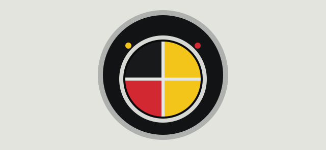

# Probable Cause — Vehicle Brands

[Design](README.md) · [Lore](../lore/README.md) · [Businesses and brands](../lore/businesses.md)

This is the official brand roster for the pilot world (O'Haven / Pinatty and
Florangia). It exists to keep brand names, segments and tone consistent as
more cars get built. The detailed model/spec catalog begins with the
[BWC 360](../assets/bwc-360.md) and will expand as cars are finished.

**Two tiers below: catalog and draft.** Catalog entries are wired into
[`src/app/player_car_catalog.h`](../../src/app/player_car_catalog.h), under
`F1 > Vehicle > Choose Car`. Draft makers have no selectable vehicle. Model
availability and emblem installation are separate: a catalog model does not
imply its proposed badge is fitted.
The roster was checked against source on 2026-09-12; this documentation pass
does not repeat each model's runtime validation.

## Catalog brands and fleet label

15 manufacturers plus the Municipal fleet label, with 38 selectable models,
confirmed against the catalog on 2026-09-26.

| Brand | Segment / vibe | Catalog models |
|---|---|---|
| **ALDER** | Everyday economy — city hatch to family wagon | Pip, Ridge, Wayfarer |
| **BWC** | Durable Belgian compact family and fleet cars | 360 |
| **EMBER** | Sports cars — wide, low, mid-engine | GT |
| **FANG** | Motorcycles — light, quick-steering | Venom |
| **GLM** (General Lifetime Motors) | Family transport through flagship performance | Lunge, Meridian, Zip |
| **HALCYON** | Old-money heritage — pre-war sedan to limousine | Six Sedan, Sovereign Limo |
| **HARROW** | Commercial and municipal-adjacent utility | Cityliner Bus, Hauler Semi, Hookline, Parcel, Workman |
| **LEGACY** | The original all-rounder line — the game's oldest cars | Car 5, Car 5-Next, Car 5-Next Patrol, Car 8, Car 8 Ambulance |
| **MONTROSE** | Formal 1930s luxury | Regent Eight |
| **MUNICIPAL** | Not a manufacturer — the city fleet livery itself | Ambulance, Firetruck, Cruiser 91-A/B/C/D/E |
| **ORISON** | Boutique retro sports coupe, 1990s | Cinder GT |
| **PIZAZ** | 1990s retro-inspired family sedan | Constant |
| **RODEO** | Pickup trucks and 4x4s | Grazer 4x4, Switchback |
| **SADDLE** | 1990s sports sedans | Tango |
| **SPAGATTI** | Italian-coded exotic grand tourer | Shū |
| **VESPER** | Premium sports and GT | Mistral, Scythe, VX-91 |

Notes on the less obvious entries:

- **GLM was formerly GLR.** The Lunge and Zip kept their existing asset paths
  when renamed; Meridian expands the range with a seven-seat minivan. Use
  GLM in new writing and the catalog's asset paths for implementation.
- **MUNICIPAL isn't a car company.** It is the government fleet's own
  livery — ambulances, fire apparatus, and the Cruiser 91 family across five
  pursuit tunes. Real-world city fleets don't buy from a brand called
  "Municipal" either; treat it as an in-fiction label, not a manufacturer.
- **LEGACY is the placeholder-turned-brand.** Car 5 and Car 8 predate the
  named-brand convention; the name stuck once everything else got one.
- **Cinder stays put.** It's ORISON's model line (`ORISON CINDER GT`), not a
  free-standing brand — considered and rejected as a new brand name for
  exactly that reason.

## Draft manufacturers (no selectable vehicles)

These names are recorded in the roster. Ashworth and Regalia's first vehicles
remain future work.

| Brand | Intended segment / vibe |
|---|---|
| **ASHWORTH** | British-coded luxury saloons |
| **REGALIA** | Limousines, town cars |

**Known tension to resolve before either gets built:** the luxury/limo space
already has two occupants — HALCYON (Sovereign Limo) and MONTROSE (Regent
Eight). Ashworth and Regalia need a clearly distinct angle (era, market tier,
or body style) before modeling starts, or the roster ends up with four brands
saying the same thing.

## BWC — Belgium Working Coach

BWC is a Belgian manufacturer concept for durable compact family and fleet
cars. Its emblem deliberately plays on BMW's roundel: a formal black circular
badge, a silver edge, curved **BWC** lettering and Belgian black, yellow and
red in the center. The tone is a practical car maker taking its prestige
seriously. The previous blue shield and amber W have been superseded.

The [editable SVG](emblems/bwc.svg) preserves the reference design. The
[BWC 360 model](../assets/bwc-360.md) mounts it on the hood, trunk and steering
wheel using a production atlas cell with repository-font lettering.

| Part | Current direction |
| --- | --- |
| Outer form | Circular black enamel with a thin silver rim. |
| Lettering | Bold, light-colored BWC following the upper arc; W sits upright at the center. |
| Center | Four quarters: black upper left, red lower left, yellow on both right quarters, with a light cross divider. This is a badge arrangement, not a literal Belgian flag. |
| Accent | Small yellow and red dots on either side beneath the lettering. |
| Palette | Ring `#111315`, center black `#17191b`, yellow `#f3c51b`, red `#d22831`, rim `#aeb1ae`, lettering `#f1f1ec`. |
| Production refinement | Check letters, cross and dots at the intended grille/steering-wheel texture size. The SVG currently uses font fallbacks; choose a repository font and outline it before a final asset cook. |

**Krammeit** was floated as a possible sedan name. It remains an unapproved
model idea, with no settled specification, price, history or vehicle entry.
The first modeled vehicle is now the **360**, a compact four-door sedan.

## Emblem directions

These record the existing round-01 concept sheet. Most are proposals for
review, not installed vehicle badges. They are listed here so the design
intent survives outside the ignored preview page.

| Identity | Concept | Status / next concern |
| --- | --- | --- |
| ALDER | Folded leaf | Proposal; keep the leaf broad and the stem readable. |
| EMBER | Split ember shard | Proposal; refine the diagonal heat cut. |
| FANG | Twin teeth | Proposal; thicken the shorter tooth at small sizes. |
| GLM | Factory gate | Proposal; three pillars currently risk reading as W. |
| HALCYON | Perched kingfisher | Proposal; simplify the head and chest for metal. |
| HARROW | Steel-beam H | Proposal; add a distinctive notch rather than generic type. |
| LEGACY | Linked Ls | Proposal; tighten the stair-step gap for a trunk badge. |
| MONTROSE | Deco rose | Proposal; emphasize architectural, squared petals. |
| MUNICIPAL | Harbor beacon and wave | Proposed fleet ownership mark; separate from manufacturer identity. |
| ORISON | Broken ring | Proposal; the low bridge currently risks reading as lowercase e. |
| RODEO | Branding-iron R, black upright/bowl and orange leg | Fitted to the Grazer grille and tailgate; see the [implementation and evidence](../assets/rodeo-grazer-emblem.md). |
| SPAGATTI | Folded ribbon S | Proposal; retain the pasta nod without losing a simple silhouette. |
| VESPER | Diagonal evening needle through a diamond | Proposal; simplify thin details for small badges. |
| BWC | Belgian roundel with curved BWC | Fitted to the selectable [360 model](../assets/bwc-360.md). |

ASHWORTH and REGALIA do not yet have documented emblem directions. Before
mounting any new mark, decide its actual front/rear placement, material,
size and small-scale treatment, then record the asset work and rendered
evidence separately. A fictional vehicle maker's name does not supply its
founding year, parent company or country unless this roster says so.

## Naming convention

- Menu display is `BRAND` then `MODEL NAME`, both upper case
  (`kPlayerCarBrands` / `kPlayerCars` in `player_car_catalog.h`).
- New asset paths should use the pair in lower snake_case:
  `models/vehicles/<brand>_<model>/`, `textures/vehicles/<brand>_<model>/`.
  Existing catalog paths include exceptions such as `car5`, `orison_cinder`
  and `fang_venom_v2`, plus shared textures. Preserve those paths unless a
  separate migration owns the change.
- A manufacturer's cars can span body styles (see HARROW and LEGACY) while
  sharing a fictional maker and character. MUNICIPAL instead groups vehicles
  by fleet use; it does not establish a common manufacturer.

## Status

- [x] Brand names for RODEO and EMBER confirmed against shipped code.
- [x] BWC manufacturer and emblem direction defined; 360 four-door model created with mounted roundels.
- [x] Integrate the BWC 360 model into the selectable vehicle catalog and runtime door rig.
- [x] Current catalog names the former GLR maker GLM, with Lunge and Zip models.
- [ ] Resolve the Ashworth/Regalia luxury overlap with Halcyon/Montrose.
- [ ] Build Ashworth and Regalia's first models, if the overlap resolves in
their favor.
- [ ] Extend the per-model stats catalog (handling, top speed, price, rarity)
      beyond the BWC 360.
