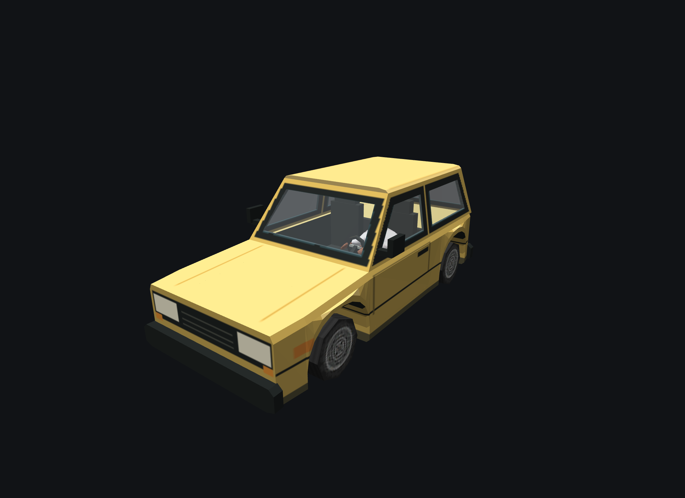

# Alder Pip

[Vehicles](../README.md) · [Alder](../Alder.md)

Light city hatch.

## Images

*Asset-lab capture.*

Saved project imagery; model renders and game captures may predate the latest refinements.

Image origins are recorded in the [source manifest](../images/sources.json).

## Model information

| Detail | Value |
|---|---|
| Manufacturer | [Alder](../Alder.md) |
| Model | Pip |
| Status | Selectable in the game catalog |
| Vehicle role | light city hatch |
| In-game mass | 1,050 kg |
| Authored wheelbase | 2.360 m |
| Authored track | 1.440 m |
| Tire radius | 0.310 m |

Dimensions and mass describe the game model and handling setup. Prices, production figures and unrecorded history remain undefined.

## Game files

- Model key: `alder_pip`.
- Body: `assets/models/vehicles/alder_pip/body.emesh`.
- Texture: `assets/textures/vehicles/alder_pip/body.png`.
- Selection: **F1 → Vehicle → Choose Car → Alder → Pip**.

Sources: [vehicle catalog](../../../../src/app/player_car_catalog.h), [handling setup](../../../../src/app/vehicle_model_tuning.h).
