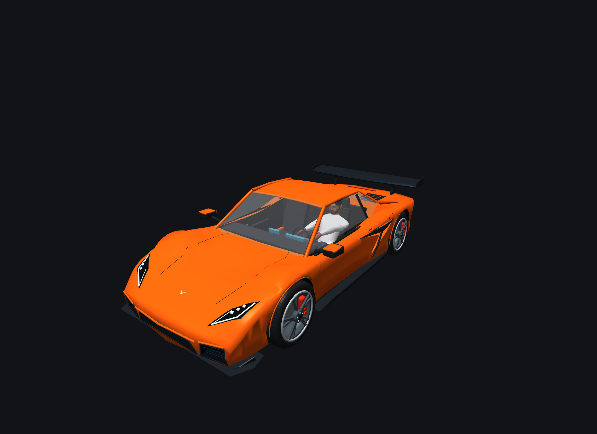
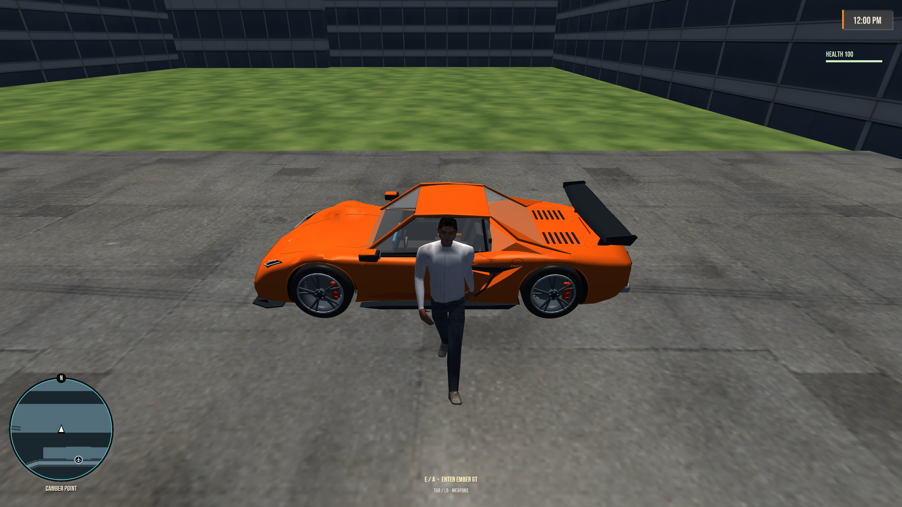

# Ember GT

[Vehicles](../README.md) · [Ember](../Ember.md)

Wide, low mid-engine sports coupe.

## Images

*Asset-lab capture.*

Saved project imagery; model renders and game captures may predate the latest refinements.

Image origins are recorded in the [source manifest](../images/sources.json).

## Model information

| Detail | Value |
|---|---|
| Manufacturer | [Ember](../Ember.md) |
| Model | GT |
| Status | Selectable in the game catalog |
| Vehicle role | wide, low mid-engine sports coupe |
| In-game mass | 1,490 kg |
| Authored wheelbase | 2.760 m |
| Authored track | 1.760 m |
| Tire radius | 0.365 m |

Dimensions and mass describe the game model and handling setup. Prices, production figures and unrecorded history remain undefined.

## Additional model views

Saved renders and captures from earlier model work; these are not generated concept references or a complete all-angle set.

### Side — archived game screenshot

## Game files

- Model key: `ember_gt`.
- Body: `assets/models/vehicles/ember_gt/body.emesh`.
- Texture: `assets/textures/vehicles/ember_gt/body.png`.
- Selection: **F1 → Vehicle → Choose Car → Ember → GT**.

Sources: [vehicle catalog](../../../../src/app/player_car_catalog.h), [handling setup](../../../../src/app/vehicle_model_tuning.h).
