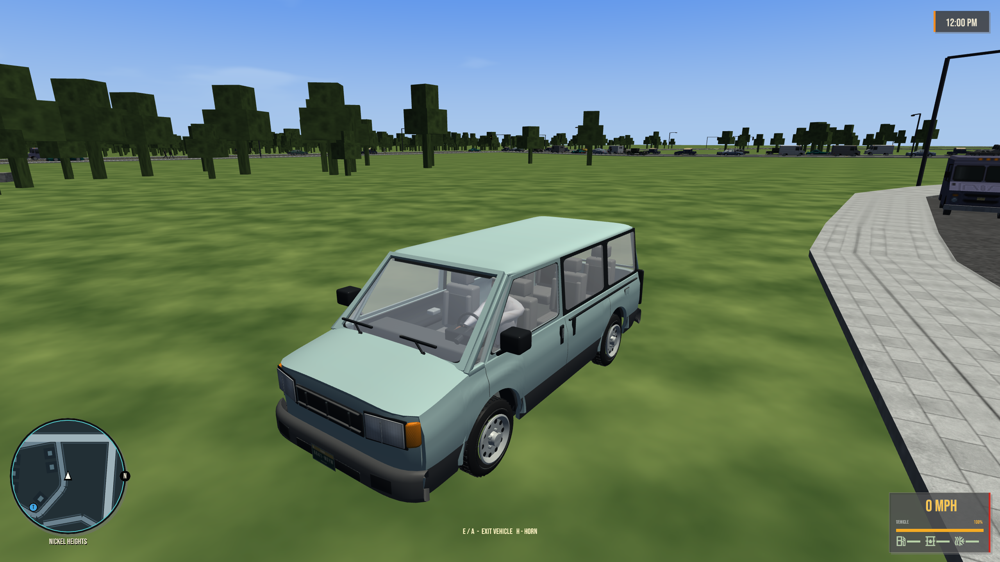
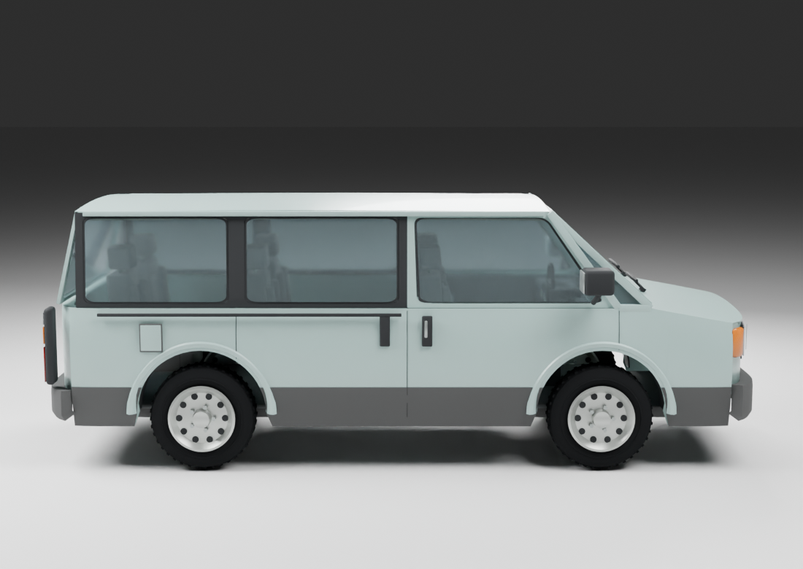
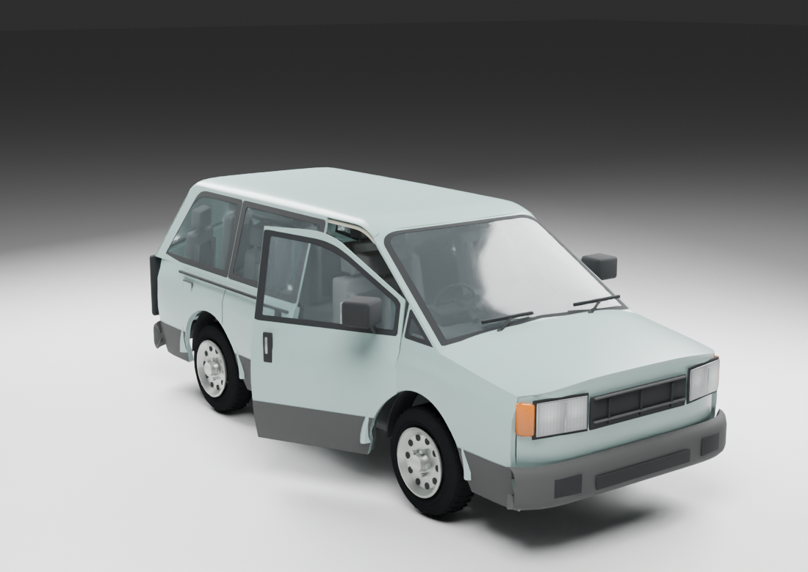
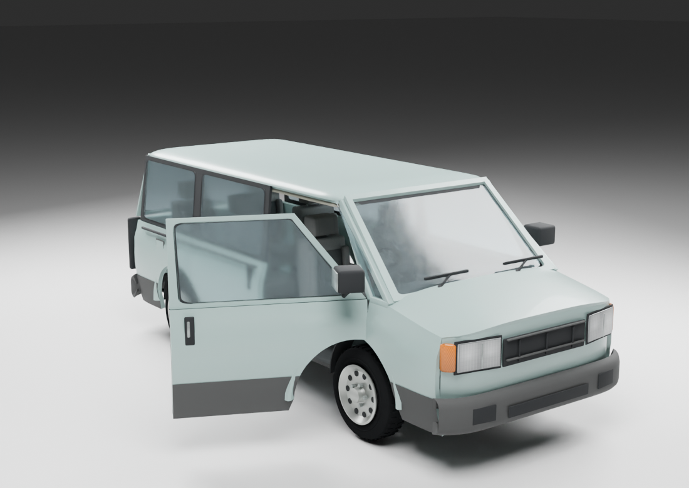
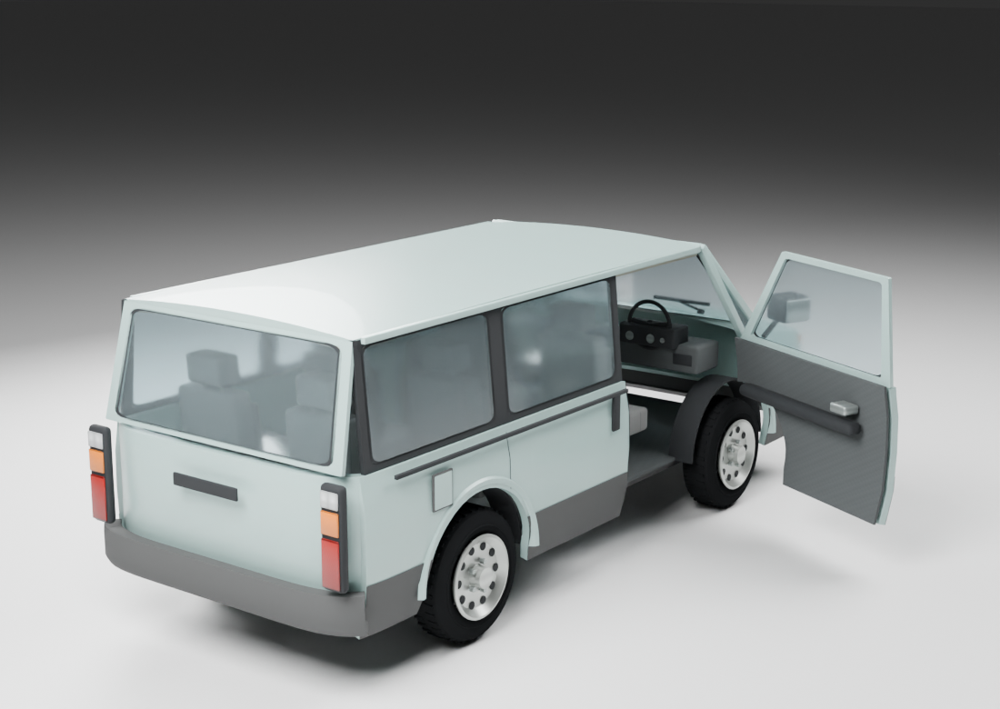

# GLM Meridian

*Selected concept — generated design reference.*

[Vehicles](../README.md) · [GLM](../GLM.md)

Seven-seat family minivan.

## Model information

| Detail | Value |
|---|---|
| Manufacturer | [GLM](../GLM.md) |
| Model | Meridian |
| Status | Selectable in the game catalog |
| Vehicle role | seven-seat family minivan |
| In-game mass | 1,750 kg |
| Authored wheelbase | 2.780 m |
| Authored track | 1.600 m |
| Tire radius | 0.365 m |

Dimensions and mass describe the game model and handling setup. Prices, production figures and unrecorded history remain undefined.

## Design and construction

1991 family minivan in pale seafoam with charcoal bumpers, dark window pillars, rectangular twin-optic lamps and sliding-door tracks. The model has three seat rows, transparent glass, a mapped cabin and a hinged driver door. The latest pass rounds the roof corners, rolls the roof and bumper edges, and softens the hood shoulders and side panels.

[Detailed reference and construction notes](../../../design/references/glm_meridian/README.md).

## Reference photos

Generated design references, shown here as the visual target.

### Front three-quarter

### Rear three-quarter

### Front

### Rear

### Left side

### Right side

### Top

## Current playable model

[More model angles and door views](../../../design/reviews/1991-vehicle-refinement/README.md#glm-meridian).

## Additional model and door views

### Rear three-quarter

### Side

### Door partly open

### Door open

### Door interior

## Performance

| Metric | Value |
|---|---|
| Top speed | 146.5 mph |
| 0–60 mph | 5.1 s |

Measured in the headless game-physics benchmark using **Classic GTA**, the default driving preset, on flat dry ground. Values describe the current gameplay tuning. See [conditions, source snapshot and full roster](../performance.md).

## Game files

- Model key: `glm_meridian`.
- Body: `assets/models/vehicles/glm_meridian/body.emesh`.
- Texture: `assets/textures/vehicles/glm_meridian/body.png`.
- Selection: **F1 → Vehicle → Choose Car → GLM → Meridian**.

Sources: [vehicle catalog](../../../../src/app/player_car_catalog.h), [handling setup](../../../../src/app/vehicle_model_tuning.h).
