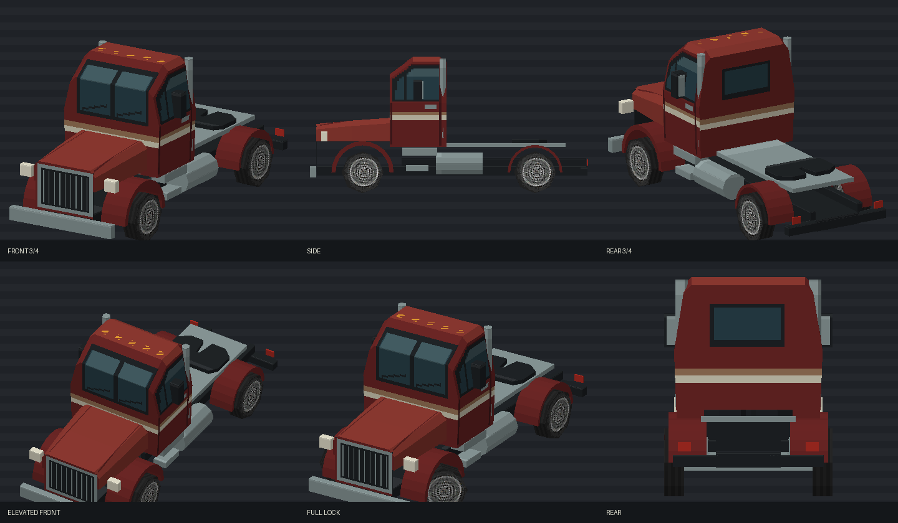

# Harrow Hauler Semi

[Vehicles](../README.md) · [Harrow](../Harrow.md)

Tractor cab.

## Images

*Model preview sheet.*

Saved project imagery; model renders and game captures may predate the latest refinements.

Image origins are recorded in the [source manifest](../images/sources.json).

## Model information

| Detail | Value |
|---|---|
| Manufacturer | [Harrow](../Harrow.md) |
| Model | Hauler Semi |
| Status | Selectable in the game catalog |
| Vehicle role | tractor cab |
| In-game mass | 6,500 kg |
| Authored wheelbase | 4.100 m |
| Authored track | 2.200 m |
| Tire radius | 0.500 m |

Dimensions and mass describe the game model and handling setup. Prices, production figures and unrecorded history remain undefined.

## Asset record

[Detailed model notes and prior validation](../../../assets/harrow-semi.md).

## Performance

| Metric | Value |
|---|---|
| Top speed | 105.4 mph |
| 0–60 mph | 3.9 s |

Measured in the headless game-physics benchmark using **Classic GTA**, the default driving preset, on flat dry ground. Values describe the current gameplay tuning. See [conditions, source snapshot and full roster](../performance.md).

## Game files

- Model key: `harrow_hauler`.
- Body: `assets/models/vehicles/harrow_hauler/body.emesh`.
- Texture: `assets/textures/vehicles/harrow_hauler/body.png`.
- Selection: **F1 → Vehicle → Choose Car → Harrow → Hauler Semi**.

Sources: [vehicle catalog](../../../../src/app/player_car_catalog.h), [handling setup](../../../../src/app/vehicle_model_tuning.h).
