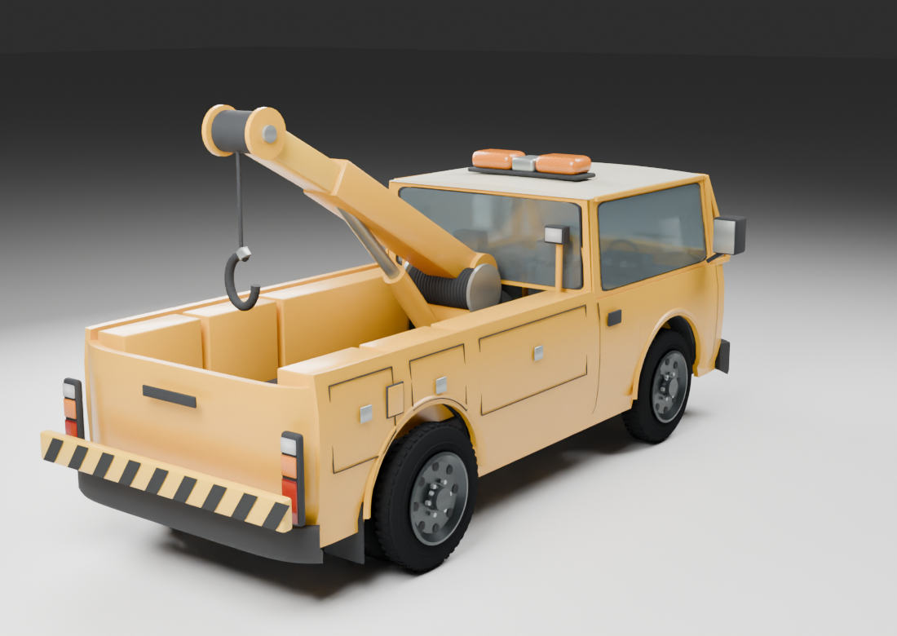
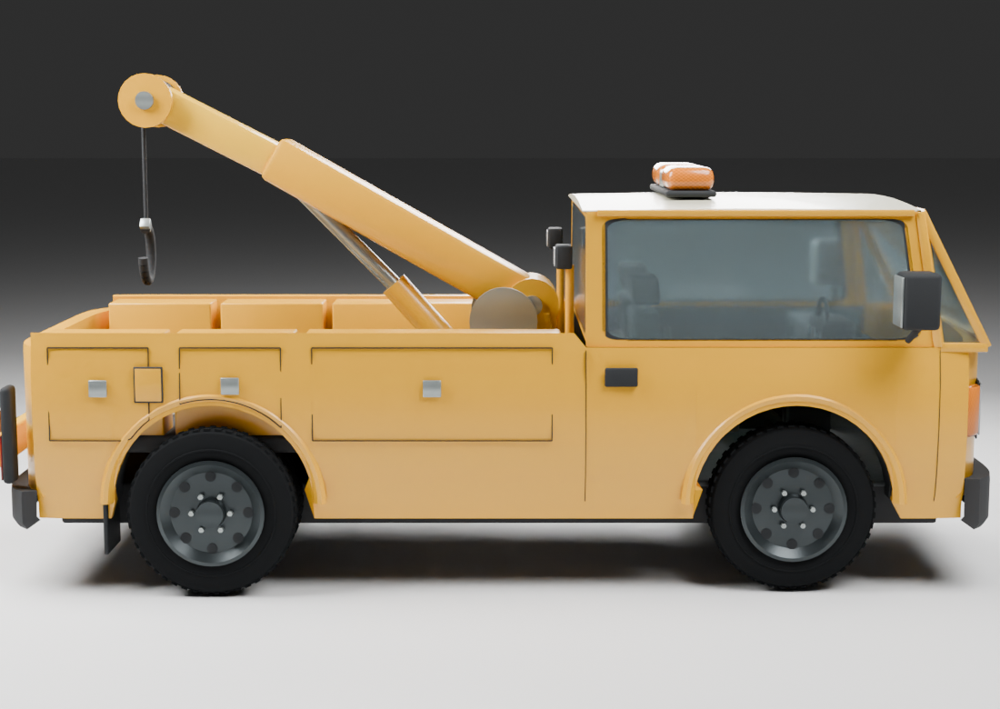
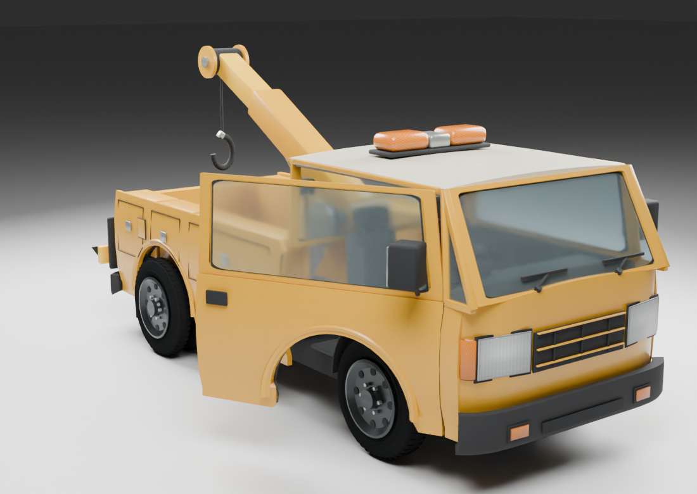
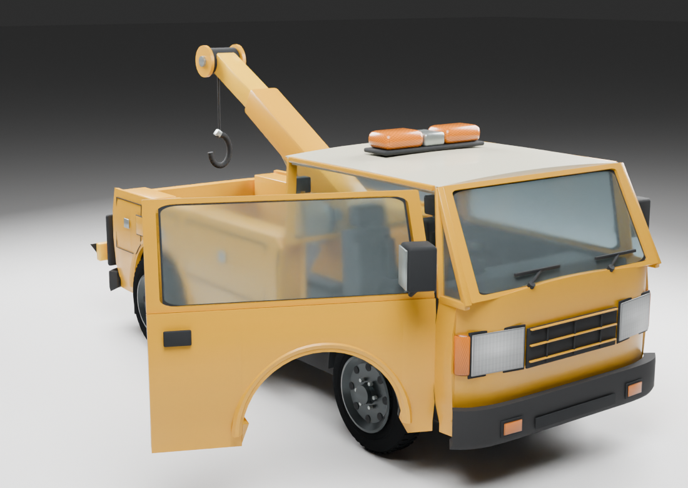
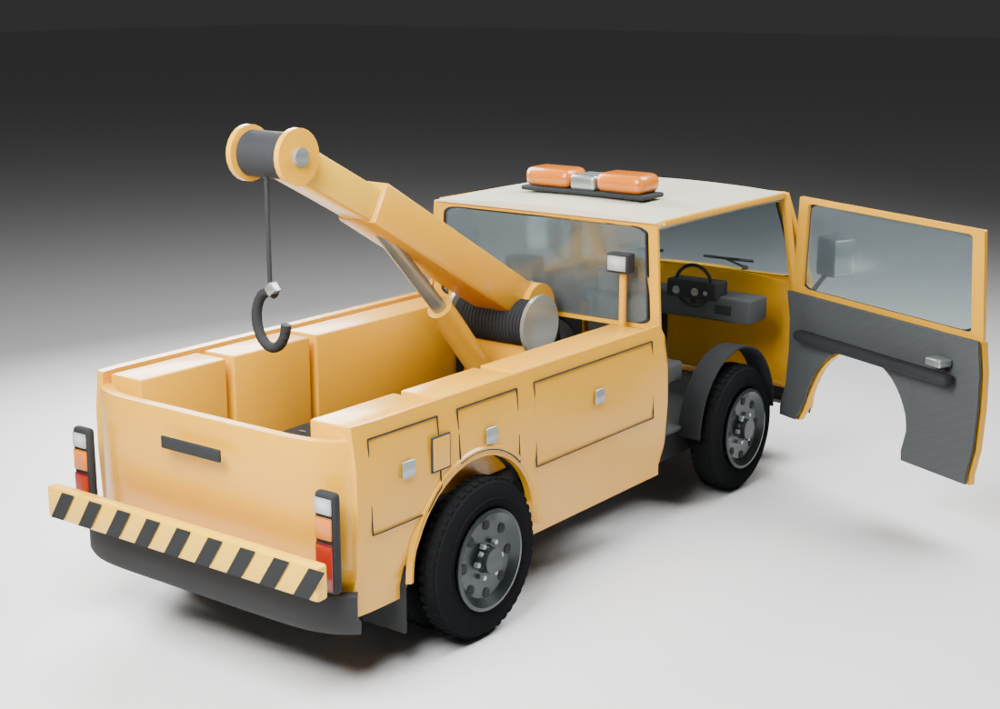

# Harrow Hookline

*Selected concept — generated design reference.*

[Vehicles](../README.md) · [Harrow](../Harrow.md)

City recovery truck.

**Class 3 — design and detail benchmark.** User-designated alongside Pizaz Constant and Rodeo Switchback as a reference for bringing Class 1 and Class 2 vehicles up to the same standard of design, detail, documentation and reference imagery. See [vehicle quality classes](../quality-classes.md).

## Model information

| Detail | Value |
|---|---|
| Manufacturer | [Harrow](../Harrow.md) |
| Model | Hookline |
| Quality class | **Class 3** — user-designated benchmark |
| Status | Selectable in the game catalog |
| Vehicle role | city recovery truck |
| In-game mass | 4,200 kg |
| Authored wheelbase | 3.200 m |
| Authored track | 1.800 m |
| Tire radius | 0.460 m |

Dimensions and mass describe the game model and handling setup. Prices, production figures and unrecorded history remain undefined.

## Design and construction

1991 city recovery truck with service lockers, a supported recovery boom, winch, cable, sheave, hook and rear dual tires. The glass is transparent and the cab is mapped inside. The recovery equipment is visual modeling; towing gameplay is not implemented by this model.

[Detailed reference and construction notes](../../../design/references/harrow_hookline/README.md).

## Reference photos

Generated design references, shown here as the visual target.

### Front three-quarter

### Rear three-quarter

### Front

### Rear

### Left side

### Right side

### Top

## Current playable model

[More model angles and door views](../../../design/reviews/1991-vehicle-refinement/README.md#harrow-hookline).

## Additional model and door views

### Rear three-quarter

### Side

### Door partly open

### Door open

### Door interior

## Performance

| Metric | Value |
|---|---|
| Top speed | 138.5 mph |
| 0–60 mph | 5.0 s |

Measured in the headless game-physics benchmark using **Classic GTA**, the default driving preset, on flat dry ground. Values describe the current gameplay tuning. See [conditions, source snapshot and full roster](../performance.md).

## Game files

- Model key: `harrow_hookline`.
- Body: `assets/models/vehicles/harrow_hookline/body.emesh`.
- Texture: `assets/textures/vehicles/harrow_hookline/body.png`.
- Selection: **F1 → Vehicle → Choose Car → Harrow → Hookline**.

Sources: [vehicle catalog](../../../../src/app/player_car_catalog.h), [handling setup](../../../../src/app/vehicle_model_tuning.h).
