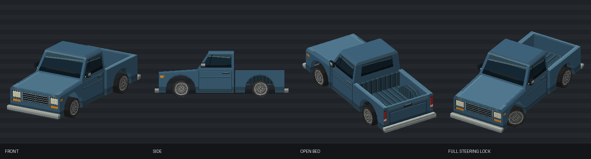

# Harrow Workman

[Vehicles](../README.md) · [Harrow](../Harrow.md)

Torquey utility pickup.

## Images

*Model preview sheet.*

Saved project imagery; model renders and game captures may predate the latest refinements.

Image origins are recorded in the [source manifest](../images/sources.json).

## Model information

| Detail | Value |
|---|---|
| Manufacturer | [Harrow](../Harrow.md) |
| Model | Workman |
| Status | Selectable in the game catalog |
| Vehicle role | torquey utility pickup |
| In-game mass | 1,980 kg |

Dimensions and mass describe the game model and handling setup. Prices, production figures and unrecorded history remain undefined.

## Game files

- Model key: `harrow_workman`.
- Body: `assets/models/vehicles/harrow_workman/body_surface.emesh`.
- Texture: `assets/textures/vehicles/harrow_workman/body_surface.png`.
- Selection: **F1 → Vehicle → Choose Car → Harrow → Workman**.

Sources: [vehicle catalog](../../../../src/app/player_car_catalog.h), [handling setup](../../../../src/app/vehicle_model_tuning.h).
