# Karlsdale Lux

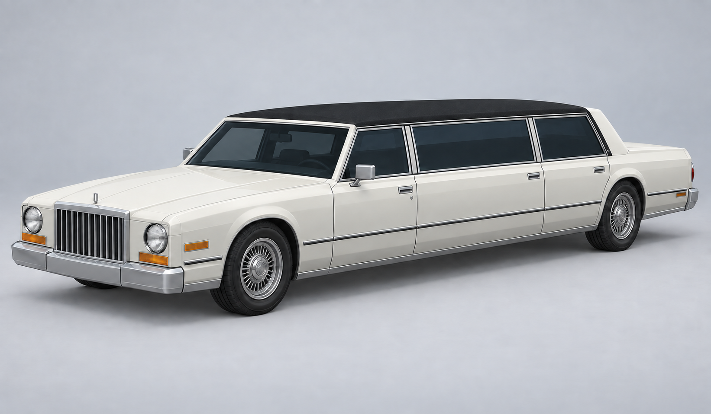

*Selected concept — generated design reference.*

[Vehicles](../README.md) · [Karlsdale](../Karlsdale.md)

Long limousine.

## Images

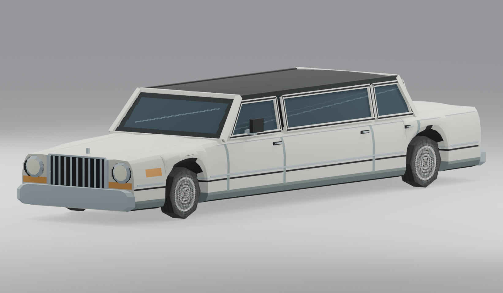

*Model render.*

Saved project imagery; model renders and game captures may predate the latest refinements.

Image origins are recorded in the [source manifest](../images/sources.json).

## Model information

| Detail | Value |
|---|---|
| Manufacturer | [Karlsdale](../Karlsdale.md) |
| Model | Lux |
| Status | Selectable in the game catalog |
| Vehicle role | long limousine |
| In-game mass | 2,750 kg |
| Authored wheelbase | 5.550 m |
| Authored track | 1.780 m |
| Tire radius | 0.360 m |

Dimensions and mass describe the game model and handling setup. Prices, production figures and unrecorded history remain undefined.

## Naming

The current working catalog groups this car under Karlsdale. Its older Halcyon or Montrose identifiers remain in the saved-game and asset paths for compatibility.

## Reference photos

Generated design references. The selected concept above also provides the front three-quarter view.

### Lux reference — Rear three-quarter

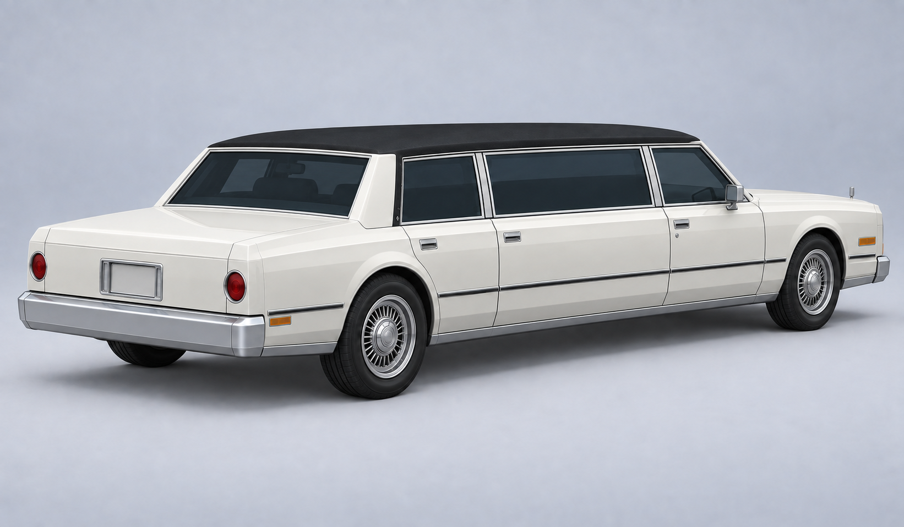

### Lux reference — Front

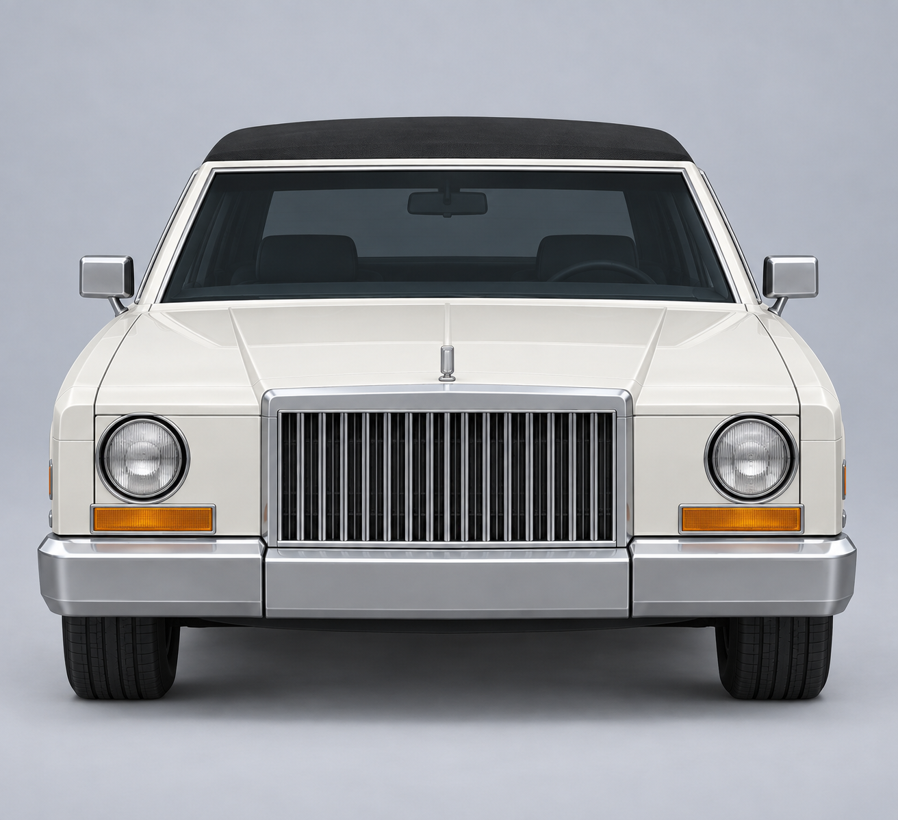

### Lux reference — Rear

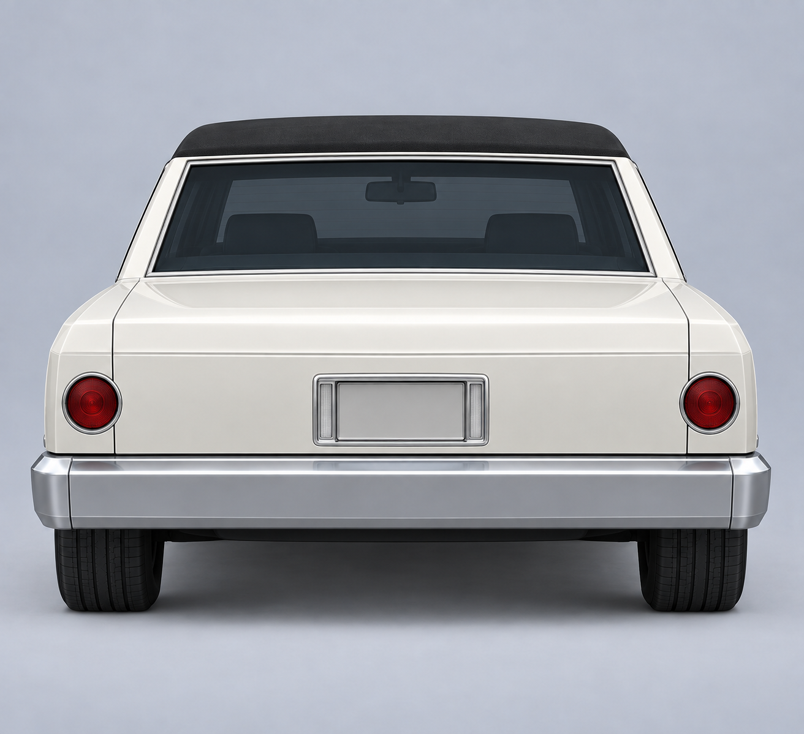

### Lux reference — Left side

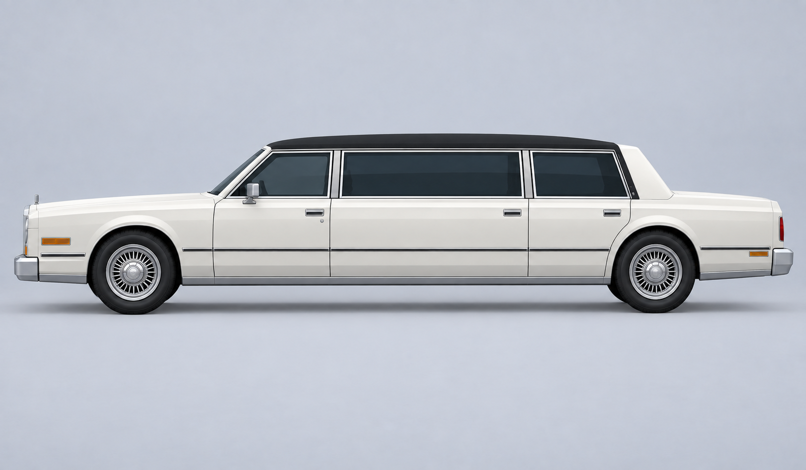

### Lux reference — Right side

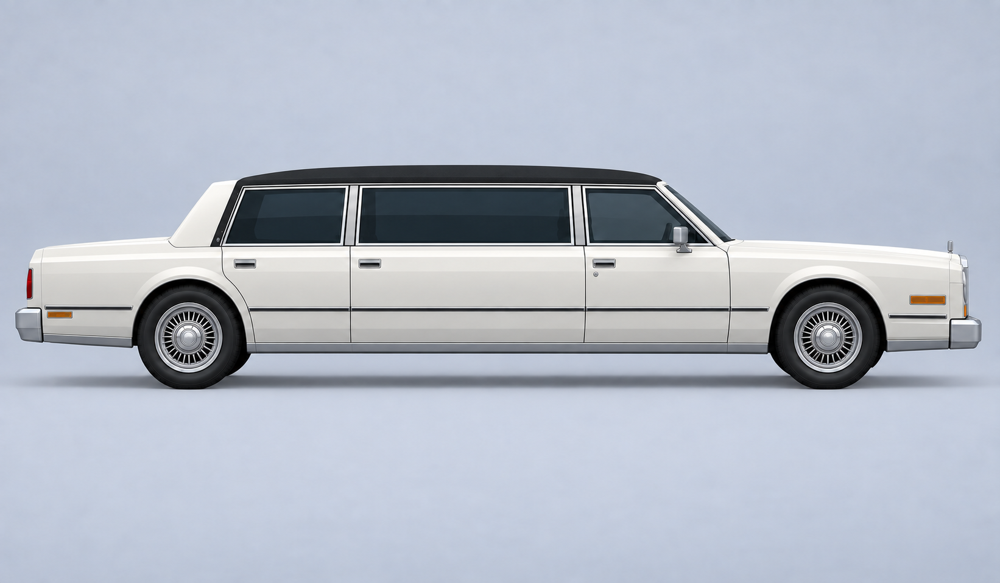

### Lux reference — Top

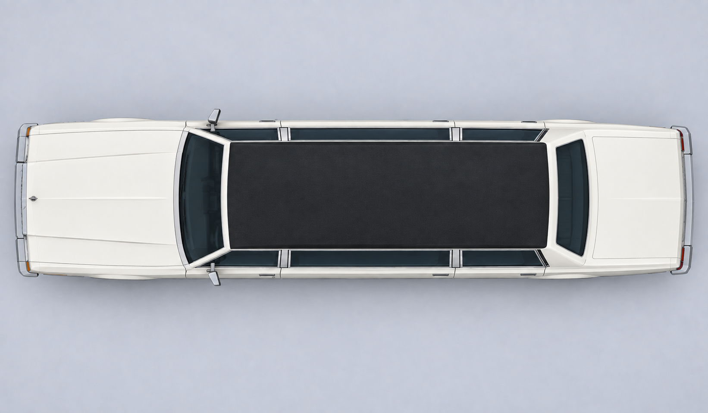

## Model angles

Saved model renders corresponding to the reference views. The front three-quarter render is in the Images section above; these may predate later changes.

### Lux model — Rear three-quarter

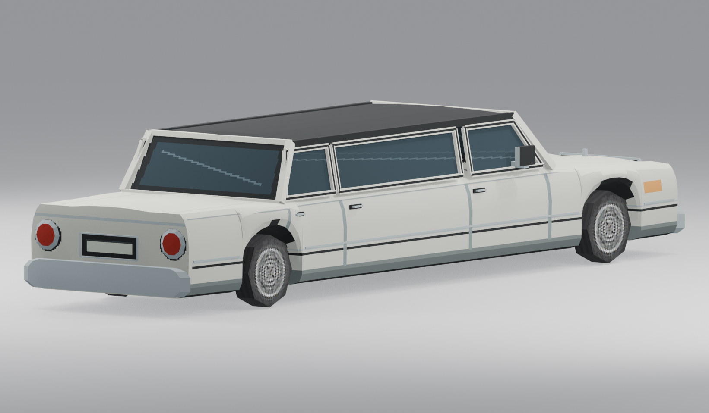

### Lux model — Front

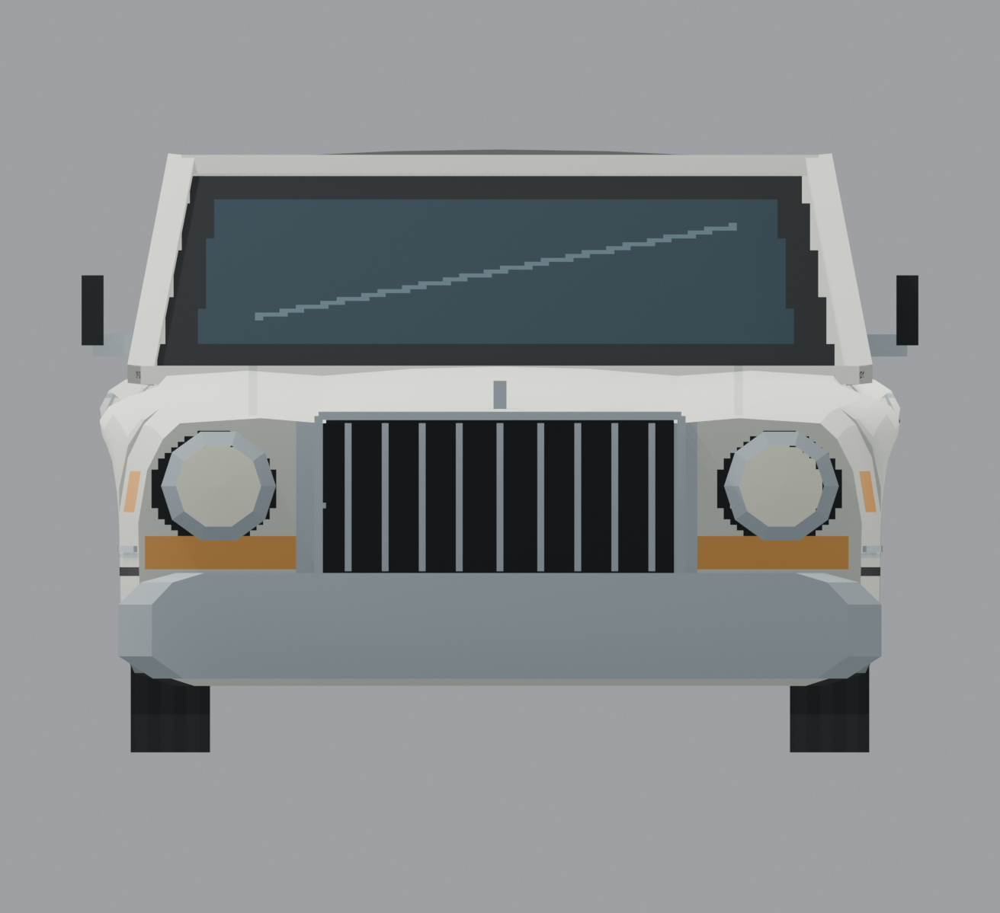

### Lux model — Rear

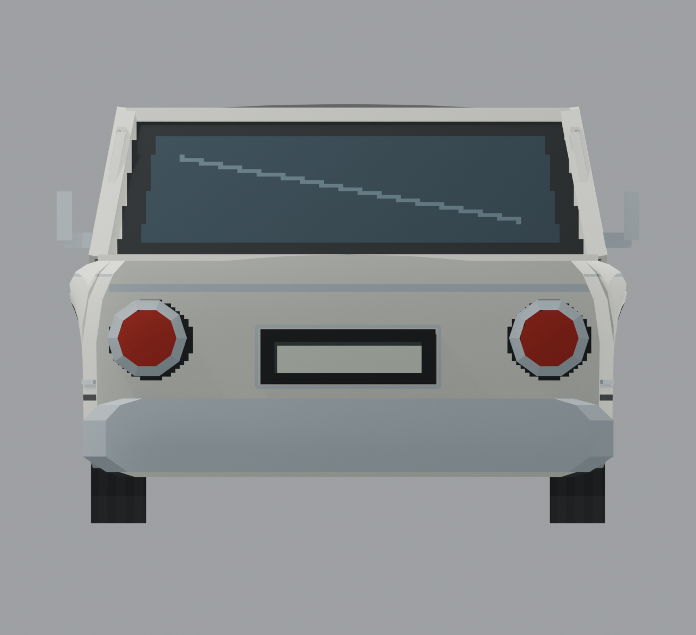

### Lux model — Left side

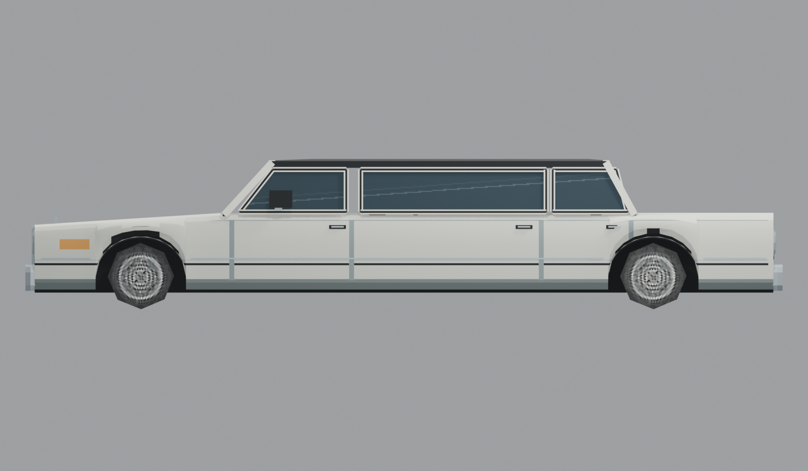

### Lux model — Right side

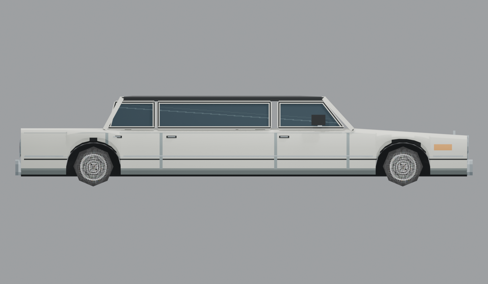

### Lux model — Top

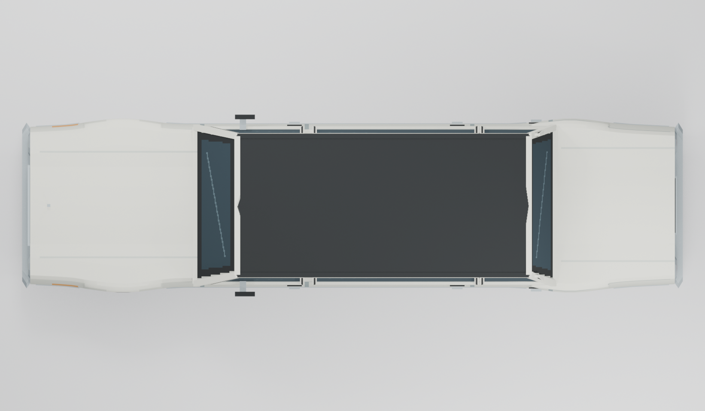

## Game files

- Model key: `halcyon_sovereign`.
- Body: `assets/models/vehicles/halcyon_sovereign/body.emesh`.
- Texture: `assets/textures/vehicles/halcyon_sovereign/body.png`.
- Selection: **F1 → Vehicle → Choose Car → Karlsdale → Lux**.

Sources: [vehicle catalog](../../../../src/app/player_car_catalog.h), [handling setup](../../../../src/app/vehicle_model_tuning.h).
