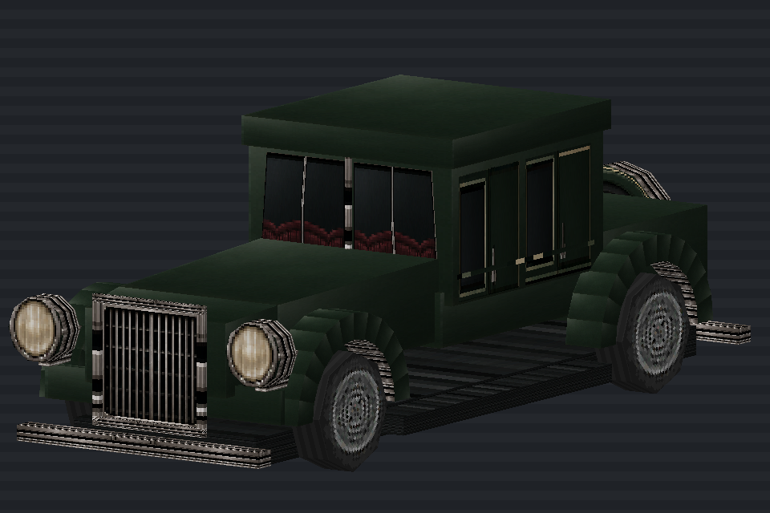

# Karlsdale Regent Eight

[Vehicles](../README.md) · [Karlsdale](../Karlsdale.md)

1930s formal luxury car.

## Images

*Model preview, saved under the former Montrose name.*

Saved project imagery; model renders and game captures may predate the latest refinements.

Image origins are recorded in the [source manifest](../images/sources.json).

## Model information

| Detail | Value |
|---|---|
| Manufacturer | [Karlsdale](../Karlsdale.md) |
| Model | Regent Eight |
| Status | Selectable in the game catalog |
| Vehicle role | 1930s formal luxury car |
| In-game mass | 2,150 kg |

Dimensions and mass describe the game model and handling setup. Prices, production figures and unrecorded history remain undefined.

## Naming

The current working catalog groups this car under Karlsdale. Its older Halcyon or Montrose identifiers remain in the saved-game and asset paths for compatibility.

## Performance

| Metric | Value |
|---|---|
| Top speed | 83.5 mph |
| 0–60 mph | 6.2 s |

Measured in the headless game-physics benchmark using **Classic GTA**, the default driving preset, on flat dry ground. Values describe the current gameplay tuning. See [conditions, source snapshot and full roster](../performance.md).

## Game files

- Model key: `montrose_regent_eight`.
- Body: `assets/models/vehicles/montrose_regent_eight/body_surface.emesh`.
- Texture: `assets/textures/vehicles/montrose_regent_eight/body_surface.png`.
- Selection: **F1 → Vehicle → Choose Car → Karlsdale → Regent Eight**.

Sources: [vehicle catalog](../../../../src/app/player_car_catalog.h), [handling setup](../../../../src/app/vehicle_model_tuning.h).
