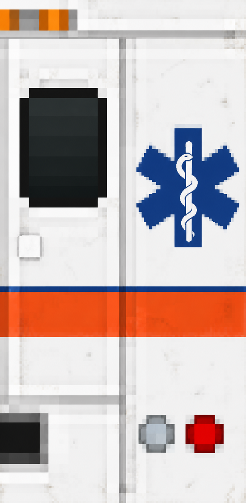
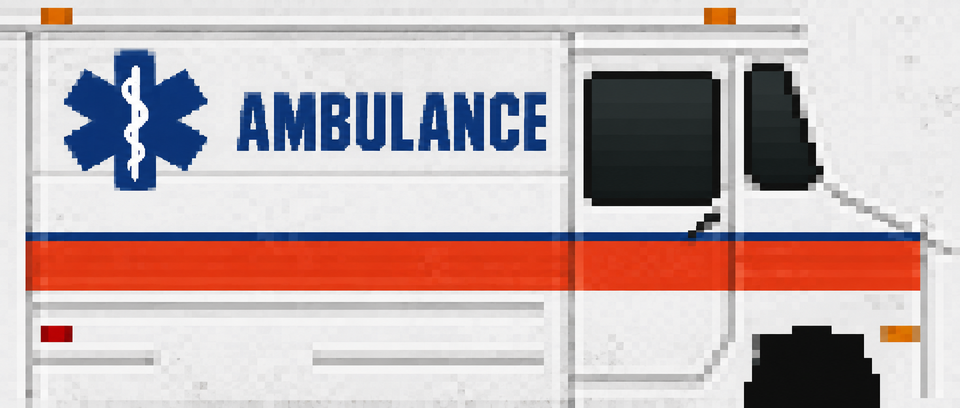

# Legacy Car 8 Ambulance

[Vehicles](../README.md) · [Legacy](../Legacy.md)

Car 8 shell, loaded ambulance.

## Images

*Generated rear-panel texture reference.*

*Generated side-panel texture reference.*

These are paint references for the model’s side and rear panels. No matching full-vehicle screenshot was found in the saved image collection.

Image origins are recorded in the [source manifest](../images/sources.json).

## Model information

| Detail | Value |
|---|---|
| Manufacturer | [Legacy](../Legacy.md) |
| Model | Car 8 Ambulance |
| Status | Selectable in the game catalog |
| Vehicle role | Car 8 shell, loaded ambulance |
| In-game mass | 1,900 kg |

Dimensions and mass describe the game model and handling setup. Prices, production figures and unrecorded history remain undefined.

## Asset record

[Detailed model notes and prior validation](../../../assets/car8-ambulance-generated-texture.md).

## Game files

- Model key: `car8`.
- Body: `assets/models/vehicles/car8/body.emesh`.
- Texture: `assets/textures/vehicles/car8/ambulance.png`.
- Selection: **F1 → Vehicle → Choose Car → Legacy → Car 8 Ambulance**.

Sources: [vehicle catalog](../../../../src/app/player_car_catalog.h), [handling setup](../../../../src/app/vehicle_model_tuning.h).
