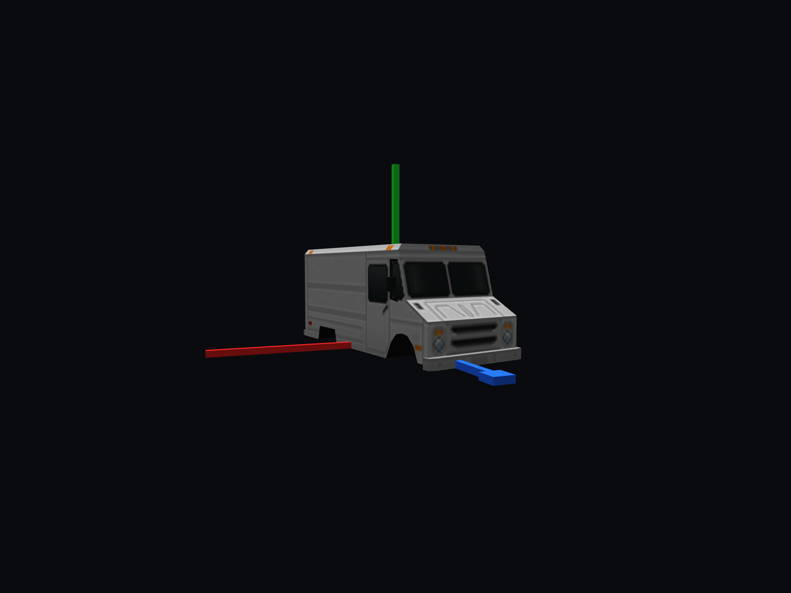

# Legacy Car 8

[Vehicles](../README.md) · [Legacy](../Legacy.md)

Larger old sedan.

## Images

*Asset-lab body capture; separately rendered wheels are omitted.*

Saved project imagery; model renders and game captures may predate the latest refinements.

Image origins are recorded in the [source manifest](../images/sources.json).

## Model information

| Detail | Value |
|---|---|
| Manufacturer | [Legacy](../Legacy.md) |
| Model | Car 8 |
| Status | Selectable in the game catalog |
| Vehicle role | larger old sedan |
| In-game mass | 1,480 kg |

Dimensions and mass describe the game model and handling setup. Prices, production figures and unrecorded history remain undefined.

## Game files

- Model key: `car8`.
- Body: `assets/models/vehicles/car8/body.emesh`.
- Texture: `assets/textures/vehicles/car8/body.png`.
- Selection: **F1 → Vehicle → Choose Car → Legacy → Car 8**.

Sources: [vehicle catalog](../../../../src/app/player_car_catalog.h), [handling setup](../../../../src/app/vehicle_model_tuning.h).
