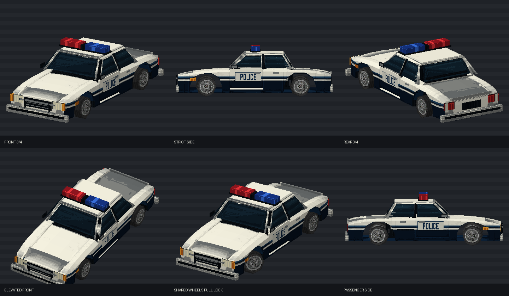

# Municipal Cruiser 91-B Aero

[Vehicles](../README.md) · [Municipal](../Municipal.md)

Cleaner transitional aero shell.

## Images

*Model preview sheet.*

Saved project imagery; model renders and game captures may predate the latest refinements.

Image origins are recorded in the [source manifest](../images/sources.json).

## Model information

| Detail | Value |
|---|---|
| Manufacturer | [Municipal](../Municipal.md) |
| Model | Cruiser 91-B Aero |
| Status | Selectable in the game catalog |
| Vehicle role | cleaner transitional aero shell |
| In-game mass | 1,745 kg |
| Authored wheelbase | 3.160 m |
| Authored track | 1.880 m |
| Tire radius | 0.340 m |

Dimensions and mass describe the game model and handling setup. Prices, production figures and unrecorded history remain undefined.

Municipal is a fleet label for city service vehicles, not a manufacturer.

## Game files

- Model key: `municipal_cruiser_91b`.
- Body: `assets/models/vehicles/municipal_cruiser_91b/body.emesh`.
- Texture: `assets/textures/vehicles/municipal_cruiser_91b/body.png`.
- Selection: **F1 → Vehicle → Choose Car → Municipal → Cruiser 91-B Aero**.

Sources: [vehicle catalog](../../../../src/app/player_car_catalog.h), [handling setup](../../../../src/app/vehicle_model_tuning.h).
