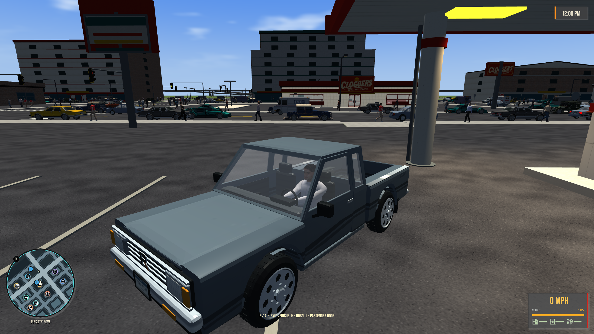
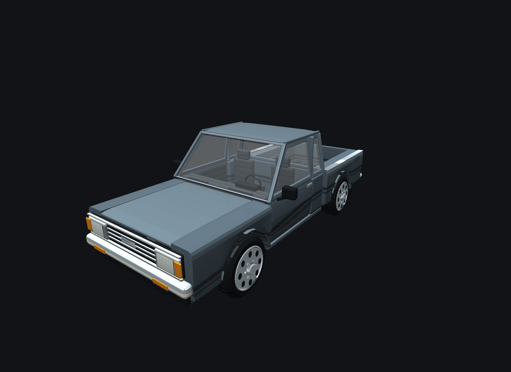
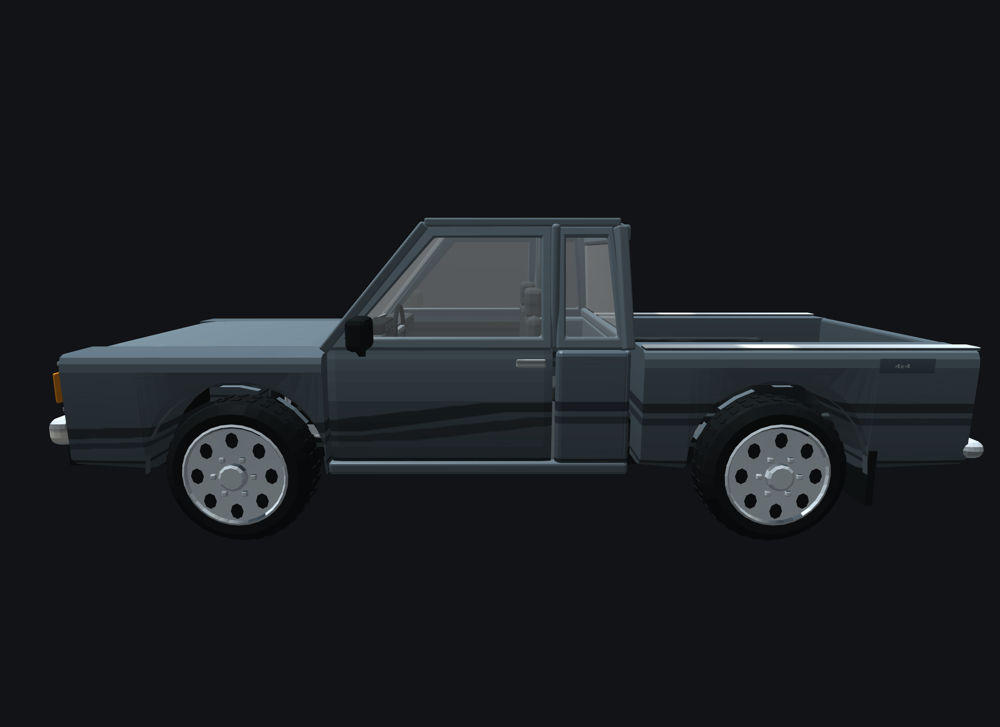
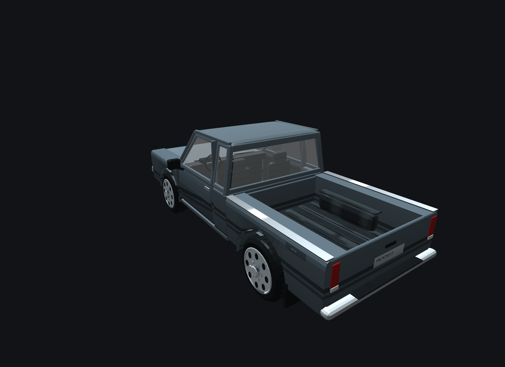

# Rodeo Grazer 4x4

[Vehicles](../README.md) · [Rodeo](../Rodeo.md)

Compact four-wheel-drive pickup.

## Images

*Game screenshot.*

Saved project imagery; model renders and game captures may predate the latest refinements.

Image origins are recorded in the [source manifest](../images/sources.json).

## Model information

| Detail | Value |
|---|---|
| Manufacturer | [Rodeo](../Rodeo.md) |
| Model | Grazer 4x4 |
| Status | Selectable in the game catalog |
| Vehicle role | compact four-wheel-drive pickup |
| In-game mass | 1,580 kg |
| Authored wheelbase | 2.930 m |
| Authored track | 1.640 m |
| Tire radius | 0.405 m |

Dimensions and mass describe the game model and handling setup. Prices, production figures and unrecorded history remain undefined.

## Asset record

[Detailed model notes and prior validation](../../../assets/rodeo-grazer-emblem.md).

## Additional model views

Saved renders and captures from earlier model work; these are not generated concept references or a complete all-angle set.

### Front three-quarter

### Side

### Rear three-quarter

## Game files

- Model key: `rodeo_grazer`.
- Body: `assets/models/vehicles/rodeo_grazer/body.emesh`.
- Texture: `assets/textures/vehicles/rodeo_grazer/body.png`.
- Selection: **F1 → Vehicle → Choose Car → Rodeo → Grazer 4x4**.

Sources: [vehicle catalog](../../../../src/app/player_car_catalog.h), [handling setup](../../../../src/app/vehicle_model_tuning.h).
