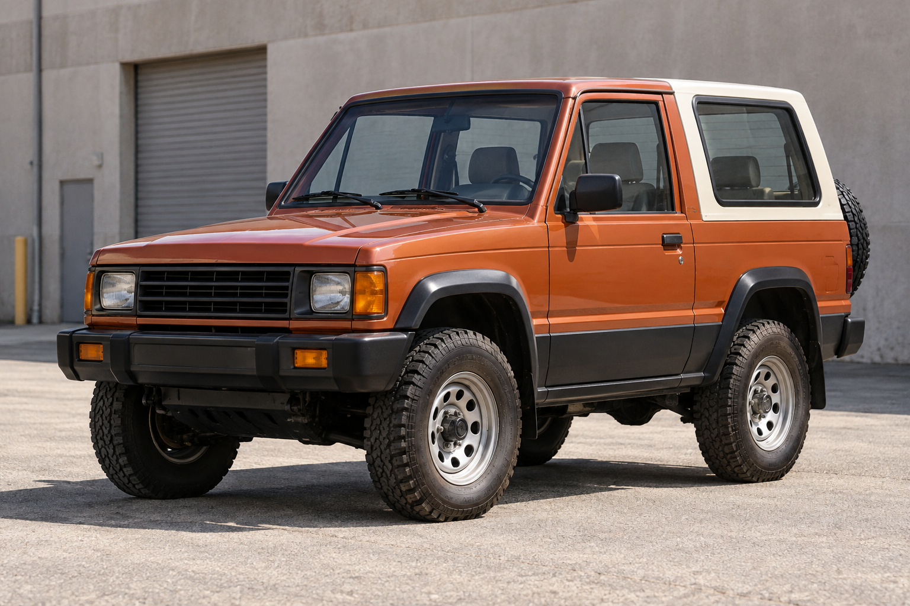
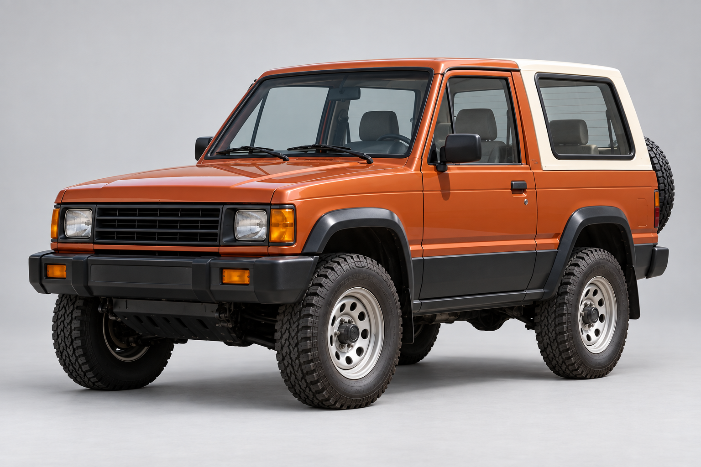
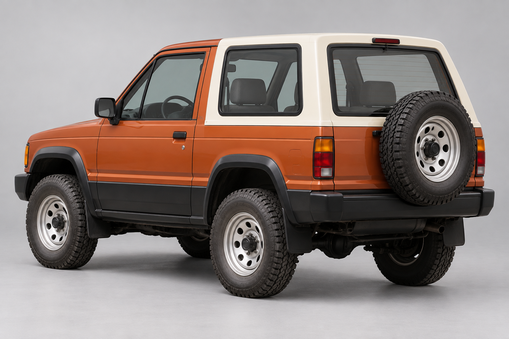
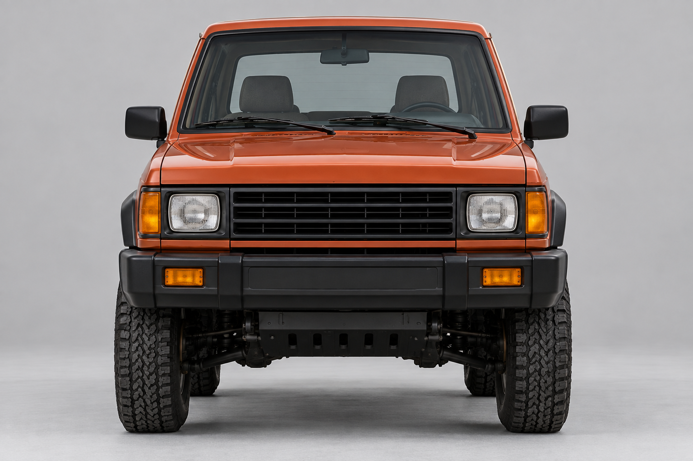
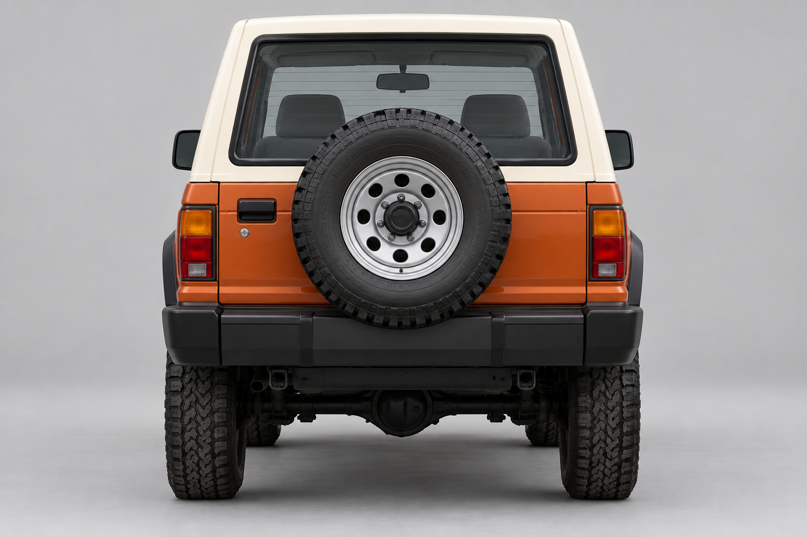
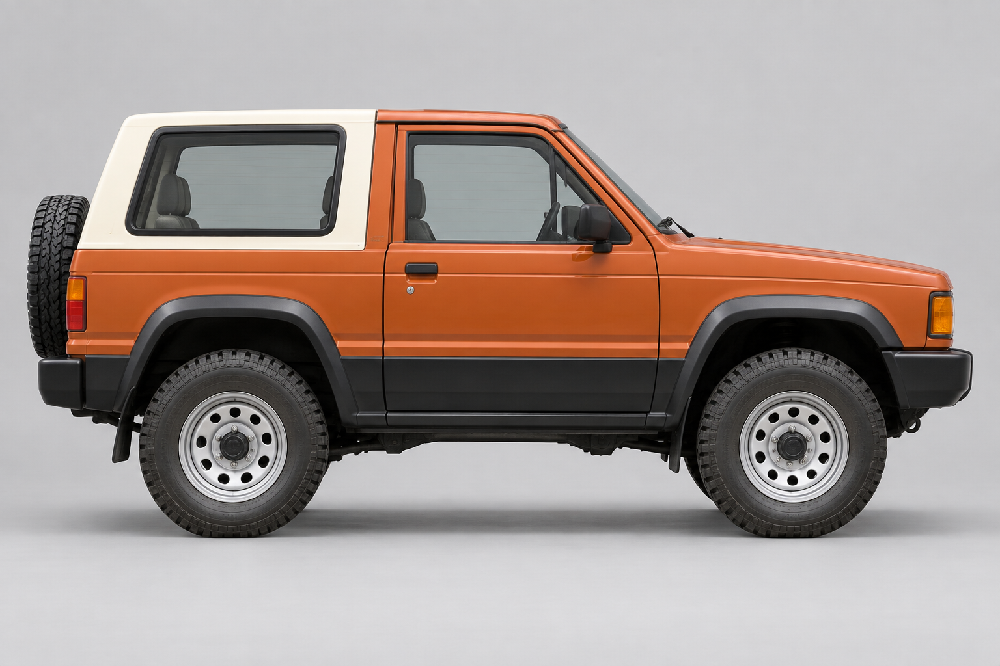
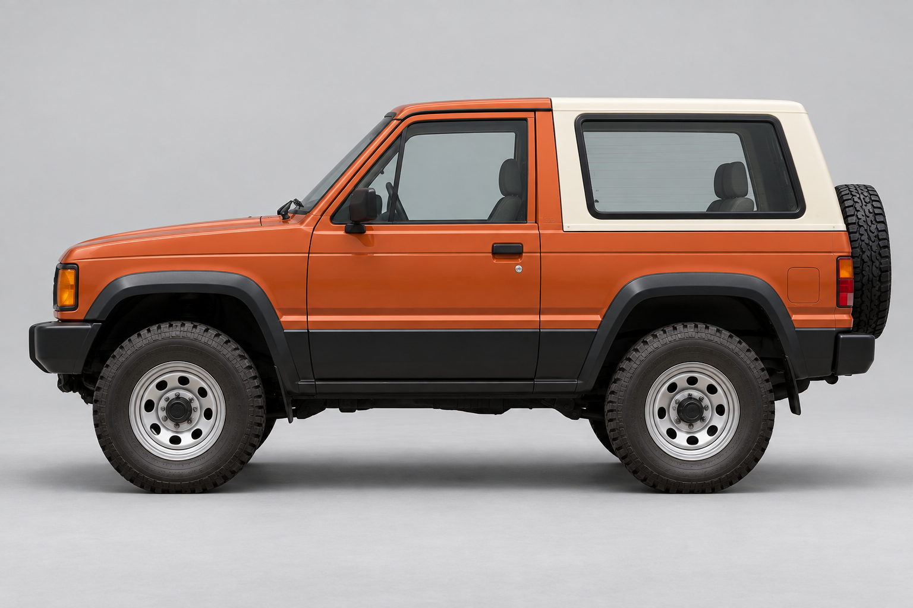
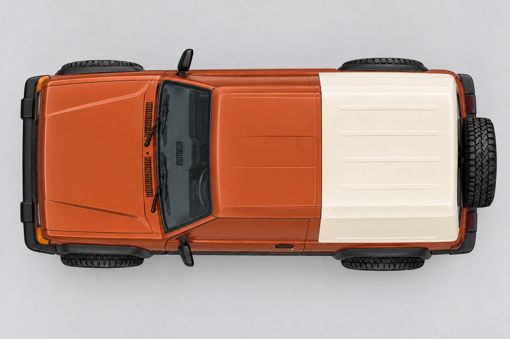
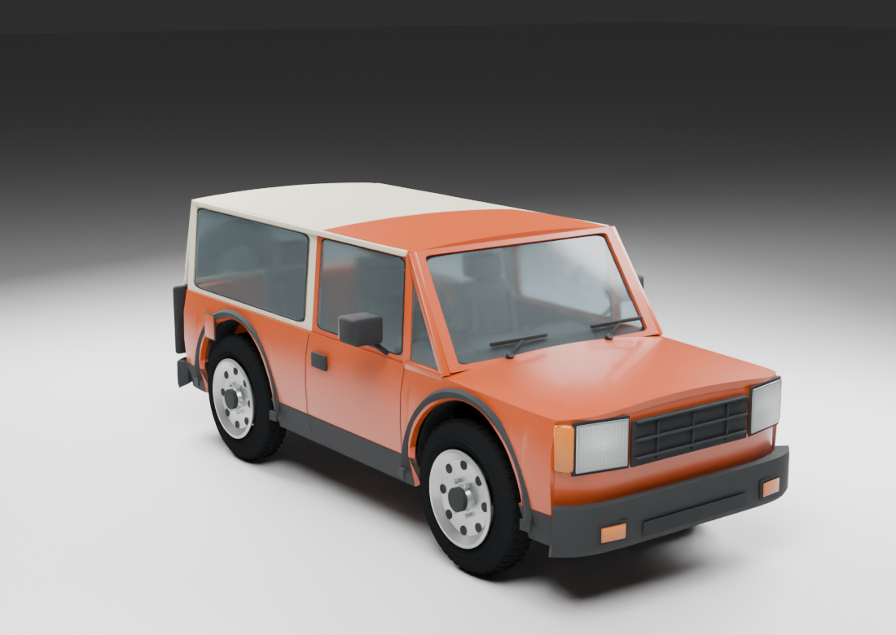
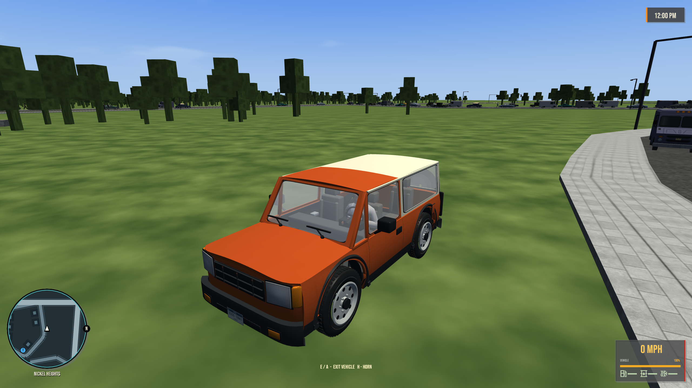

# Rodeo Switchback

[Vehicles](../README.md) · [Rodeo](../Rodeo.md)

Short-wheelbase four-wheel-drive SUV.

## Model information

| Detail | Value |
|---|---|
| Manufacturer | [Rodeo](../Rodeo.md) |
| Model | Switchback |
| Status | Selectable in the game catalog |
| Vehicle role | short-wheelbase four-wheel-drive SUV |
| In-game mass | 1,680 kg |
| Authored wheelbase | 2.730 m |
| Authored track | 1.660 m |
| Tire radius | 0.460 m |

Dimensions and mass describe the game model and handling setup. Prices, production figures and unrecorded history remain undefined.

## Design and construction

1991 short-wheelbase two-door SUV with a cream removable-style hardtop, rear-mounted spare, separate glass and mapped cabin surfaces. Its modeled front door opens with the driver entry rig.

[Detailed reference and construction notes](../../../design/references/rodeo_switchback/README.md).

## Reference photos

Generated design references, shown here as the visual target.

### Selected concept

### Front three-quarter

### Rear three-quarter

### Front

### Rear

### Left side

### Right side

### Top

## Current playable model

[More model angles and door views](../../../design/reviews/1991-vehicle-refinement/README.md#rodeo-switchback).

## Game files

- Model key: `rodeo_switchback`.
- Body: `assets/models/vehicles/rodeo_switchback/body.emesh`.
- Texture: `assets/textures/vehicles/rodeo_switchback/body.png`.
- Selection: **F1 → Vehicle → Choose Car → Rodeo → Switchback**.

Sources: [vehicle catalog](../../../../src/app/player_car_catalog.h), [handling setup](../../../../src/app/vehicle_model_tuning.h).
