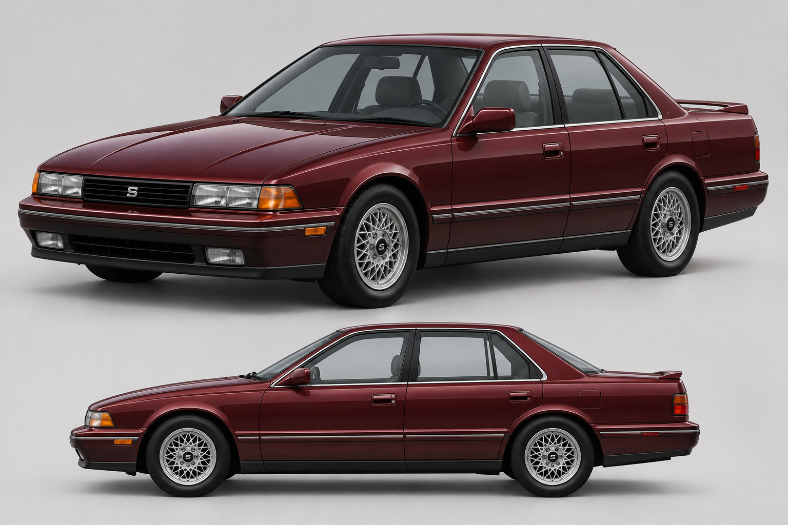
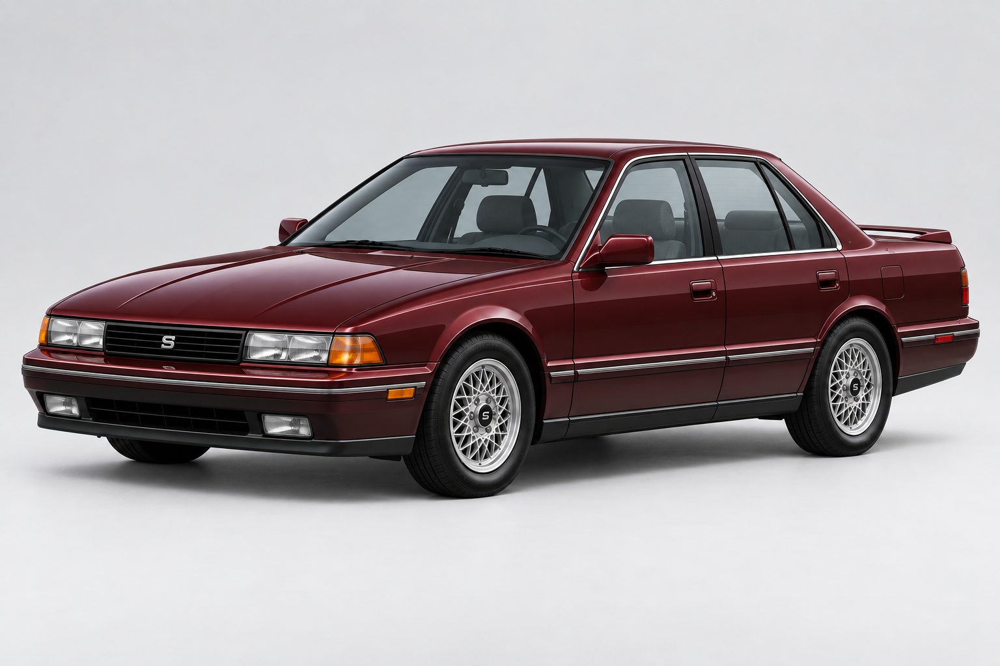
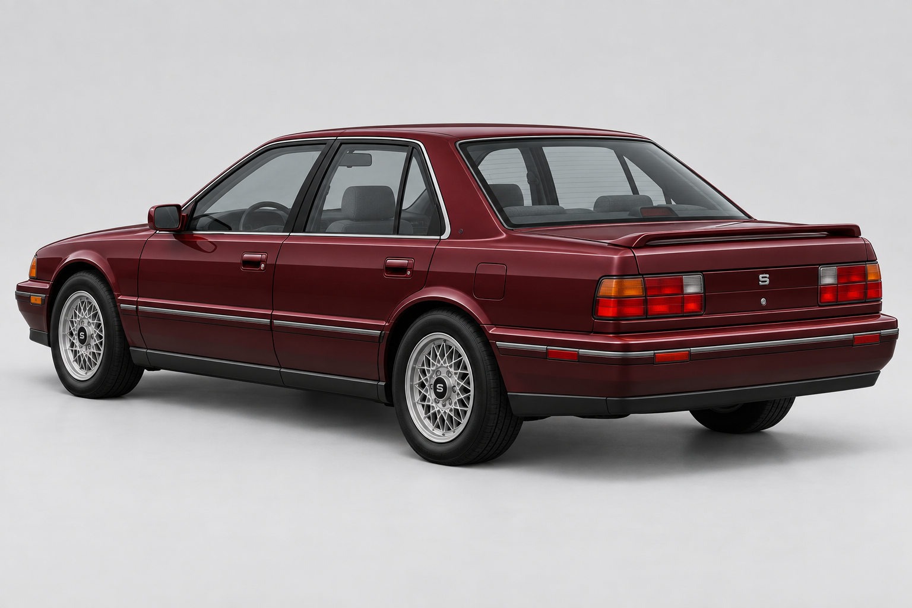
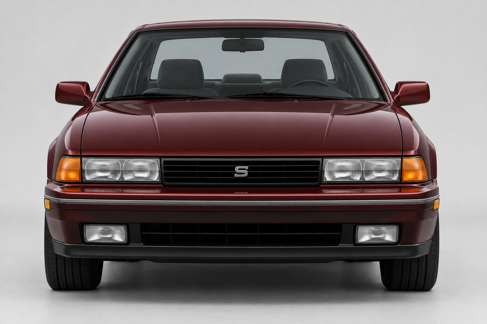
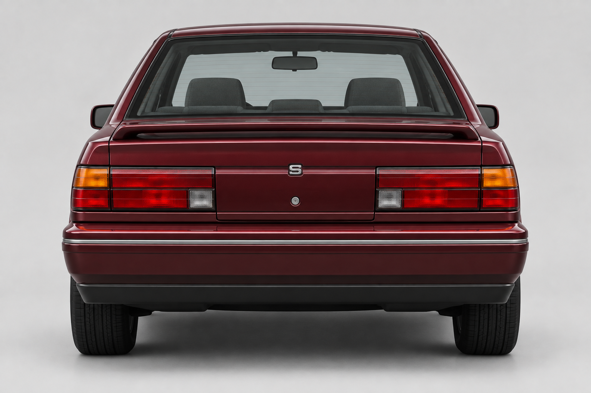
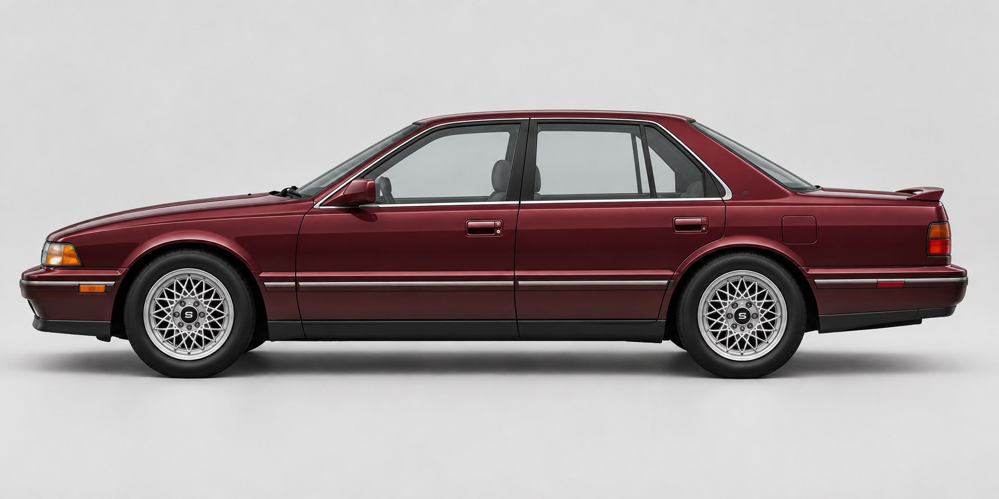
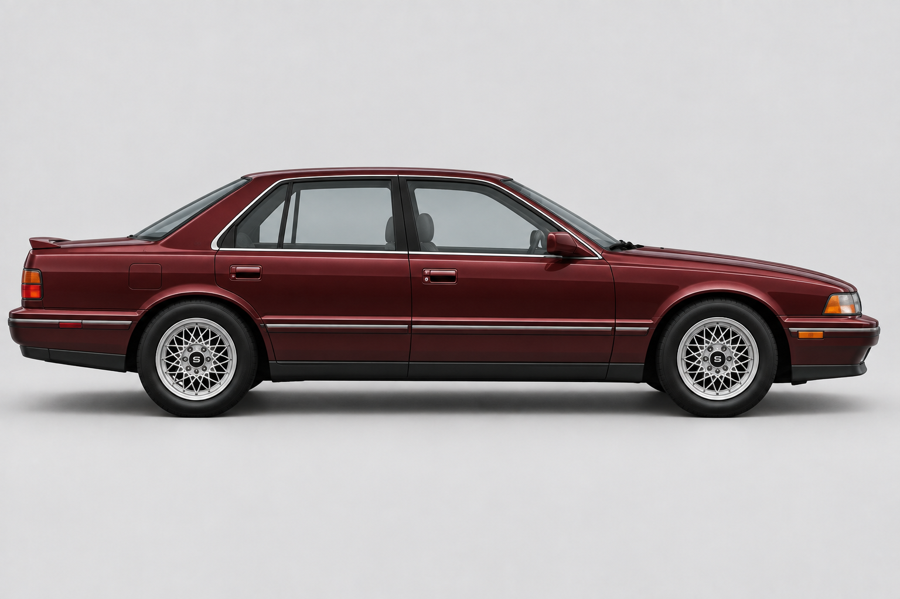
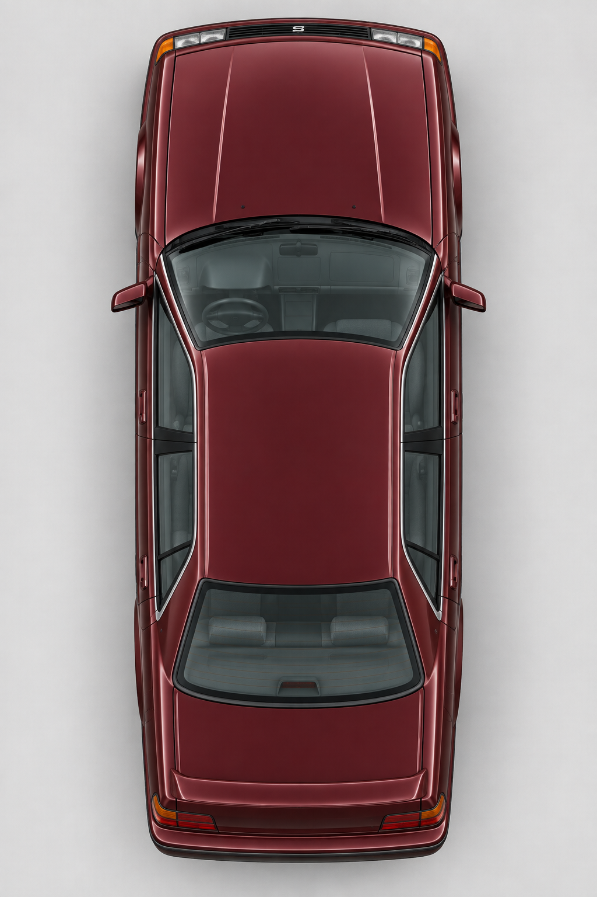

# Saddle Tango

*Selected concept — generated design reference.*

[Vehicles](../README.md) · [Saddle](../Saddle.md)

Balanced 1991 sport sedan.

## Model information

| Detail | Value |
|---|---|
| Manufacturer | [Saddle](../Saddle.md) |
| Model | Tango |
| Status | Selectable in the game catalog |
| Vehicle role | balanced 1991 sport sedan |
| In-game mass | 1,420 kg |
| Authored wheelbase | 2.750 m |
| Authored track | 1.680 m |
| Tire radius | 0.350 m |

Dimensions and mass describe the game model and handling setup. Prices, production figures and unrecorded history remain undefined.

## Design and construction

1991 sport sedan with separate transparent glass, a finished cabin and mapped inner door surfaces. Concept B established the Saddle Tango identity.

[Detailed reference and construction notes](../../../design/references/saddle_tango/README.md).

## Reference photos

Generated design references, shown here as the visual target.

### Front three-quarter

### Rear three-quarter

### Front

### Rear

### Left side

### Right side

### Top

## Game files

- Model key: `saddle_tango`.
- Body: `assets/models/vehicles/saddle_tango/body.emesh`.
- Texture: `assets/textures/vehicles/saddle_tango/body.png`.
- Selection: **F1 → Vehicle → Choose Car → Saddle → Tango**.

Sources: [vehicle catalog](../../../../src/app/player_car_catalog.h), [handling setup](../../../../src/app/vehicle_model_tuning.h).
