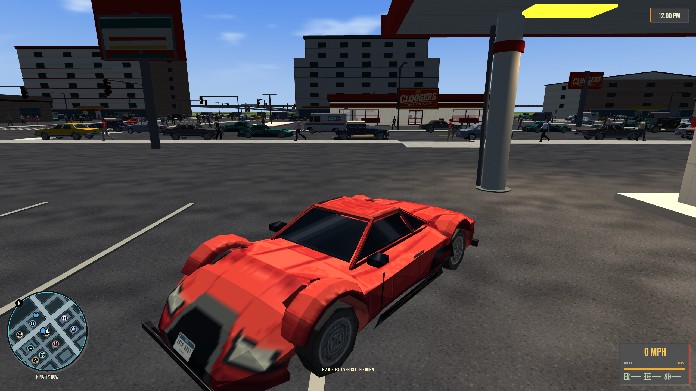

# Spagatti Shū

[Vehicles](../README.md) · [Spagatti](../Spagatti.md)

Low grand-touring exotic.

## Images

*Game screenshot.*

Saved project imagery; model renders and game captures may predate the latest refinements.

Image origins are recorded in the [source manifest](../images/sources.json).

## Model information

| Detail | Value |
|---|---|
| Manufacturer | [Spagatti](../Spagatti.md) |
| Model | Shū |
| Status | Selectable in the game catalog |
| Vehicle role | low grand-touring exotic |
| In-game mass | 1,460 kg |
| Authored wheelbase | 2.800 m |
| Authored track | 1.880 m |
| Tire radius | 0.340 m |

Dimensions and mass describe the game model and handling setup. Prices, production figures and unrecorded history remain undefined.

## Asset record

[Detailed model notes and prior validation](../../../assets/spagatti-shu.md).

## Game files

- Model key: `spagatti_shu`.
- Body: `assets/models/vehicles/spagatti_shu/body.emesh`.
- Texture: `assets/textures/vehicles/spagatti_shu/body.png`.
- Selection: **F1 → Vehicle → Choose Car → Spagatti → Shū**.

Sources: [vehicle catalog](../../../../src/app/player_car_catalog.h), [handling setup](../../../../src/app/vehicle_model_tuning.h).
