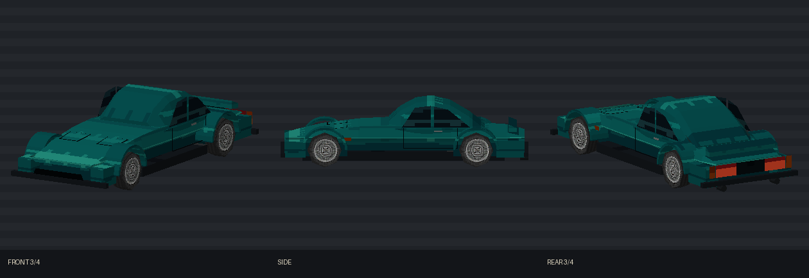

# Vesper VX-91

[Vehicles](../README.md) · [Vesper](../Vesper.md)

Large grand tourer.

## Images

*Model preview sheet.*

Saved project imagery; model renders and game captures may predate the latest refinements.

Image origins are recorded in the [source manifest](../images/sources.json).

## Model information

| Detail | Value |
|---|---|
| Manufacturer | [Vesper](../Vesper.md) |
| Model | VX-91 |
| Status | Selectable in the game catalog |
| Vehicle role | large grand tourer |
| In-game mass | 1,560 kg |

Dimensions and mass describe the game model and handling setup. Prices, production figures and unrecorded history remain undefined.

## Game files

- Model key: `vesper_vx91`.
- Body: `assets/models/vehicles/vesper_vx91/body_surface.emesh`.
- Texture: `assets/textures/vehicles/vesper_vx91/body_surface.png`.
- Selection: **F1 → Vehicle → Choose Car → Vesper → VX-91**.

Sources: [vehicle catalog](../../../../src/app/player_car_catalog.h), [handling setup](../../../../src/app/vehicle_model_tuning.h).
